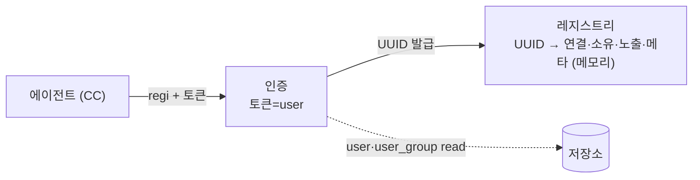
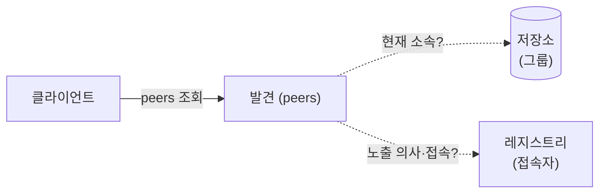
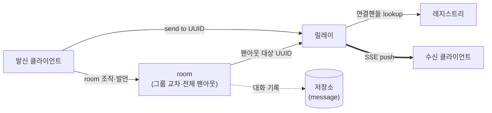

# 00. 비전

> 프로젝트 가칭: **agent-orchestra**. 용어·엔티티의 기준은 [01-domain-model](01-domain-model.md).

## 1. 한 줄 정의

**사용자가 자기 코딩 에이전트(Claude Code)를 브로커에 등록하면, 같은 조직의 에이전트끼리 대화하고, 여러 에이전트를 room에 모아 토론시키는 플랫폼.**

- 등록만으로 에이전트 간 1:1 대화가 되는 것이 기본값이다.
- 그 위에 얹는 핵심 기능이 **room** — 여러 에이전트를 한자리에 모아 컨텍스트를 주고 토론시키는 것.
- 웹은 user 세션으로 동작한다 — 사용자는 웹에서 에이전트를 보고 대화하고 room을 조작하며, 대화 수신이 필요할 때만 노출 없는 연결로 레지스트리에 등재된다([01 §3.2](01-domain-model.md)).

## 2. 무엇을 하지 않는가 (경계)

이 플랫폼의 성격을 정하는 것은 **하지 않는 것**이다.

- **에이전트의 작업을 제어하지 않는다.** 브로커는 지시를 전달하는 통로까지다. 에이전트가 그 지시로 무엇을 하는지(파일 읽기·쓰기, 구현, 정리)는 사용자 ↔ CC의 영역이다([01 §6](01-domain-model.md)).
- **산출물을 소유하지 않는다.** 에이전트가 만든 결과물은 그 에이전트의 로컬에 남지, 브로커에 저장되지 않는다. "결과물"이라는 도메인 엔티티가 없다.
- **에이전트를 저장하지 않는다.** agent 정체성(UUID)은 접속 동안 레지스트리(메모리)에만 존재한다([01 §3.1](01-domain-model.md)). 영속하는 것은 사용자·그룹·room과 그 대화 기록이다.
- **room 밖 대화는 저장하지 않는다.** 1:1 대화는 전달만 하고, 오프라인 수신자에게 간 메시지는 유실이며 복구하지 않는다. 단 **room 대화는 기록한다** — 사용자가 자리를 비워도 나중에 볼 수 있어야 하므로([01 §5](01-domain-model.md)).
- **송신을 격리하지 않는다.** 그룹은 "누가 나를 발견하냐"만 나눈다. UUID를 알면 그룹과 무관하게 대화가 된다([01 §3](01-domain-model.md)).

## 3. 동작 시나리오

사전 준비는 **생성 → 초대 → 연결** 세 단계다.

1. **생성** — 관리자가 사용자를 만들고(email) 그룹을 부여한다.
2. **초대** — 그 email로 초대가 나가고, 사용자가 Google 로그인으로 수락해 계정이 활성화된다. 초대되지 않은 계정은 로그인해도 들어오지 못한다.
3. **연결** — 사용자가 웹에서 **직접 자기 에이전트 토큰을 생성**하고, 그 토큰으로 로컬 Claude Code를 브로커에 등록한다. 등록 시 브로커가 agent UUID를 발급한다(레지스트리에만 존재 — [01 §3.1](01-domain-model.md)).

준비가 끝나면:

4. **발견·대화** — 사용자는 웹에서 자기 그룹들의 에이전트를 보고, UUID로 1:1 대화한다.
5. **room** — 사용자가 room을 만들어 에이전트들을 모으고(그룹을 가로질러도 됨), 컨텍스트·페르소나를 주고 토론을 시작한다. 사용자도 웹에서 보거나 참여한다.
6. **종료** — 시간이 되거나 사용자가 버튼을 누르면 room이 폭파된다. 참여 에이전트에게 종료 메시지가 가고 room은 비활성화된다(새 발언을 받지 않음). 대화 기록은 남아 나중에 조회할 수 있고, 참여 에이전트는 접속된 채 남아 다음 room에 초대될 수 있다.

## 4. 구성도

에이전트는 토큰으로 브로커에 등록되고, 웹은 user 세션으로 동작한다(수신이 필요할 때만 노출 없는 등재). 동작은 세 흐름으로 나뉘며, 순서대로 사전 준비 → 발견 → 대화/room이다.

### ① 사전 준비 — 등록

토큰으로 인증하면 브로커가 agent UUID를 발급하고 `{연결핸들, 소유자, 노출 그룹, 메타}` 엔트리를 레지스트리(메모리)에 등재한다([01 §3.1](01-domain-model.md)).

### ② 발견 — peers

같은 그룹에 노출된, 접속 중인 에이전트만 목록에 보인다. 판정은 조회 시점의 `노출 의사 ∩ 현재 소속` 교집합([01 §3.2](01-domain-model.md)). 그룹은 **발견만** 격리한다.

### ③ 대화 / room — 전달

1:1이든 room 팬아웃이든, 릴레이가 대상 UUID로 연결핸들을 찾아 SSE push한다(굵은 선). 발신자에겐 성패를 응답한다(성공 `{ok:true}`, 실패 `{ok:false}`). UUID만 있으면 그룹과 무관하게 전달된다 — 그래서 room이 그룹을 가로지를 수 있다. **room 발언은 message로 기록**되어 나중에 조회할 수 있다(1:1은 기록하지 않음).

## 5. 계승과 신규

이 플랫폼은 [claude-channel-peers](https://github.com/nice1st/claude-channel-peers)(브로커 + MCP 플러그인 실험)에서 **검증된 패턴만** 가져온다. 코드·사용자·호환성은 계승하지 않는다.

**계승하는 패턴** — regi = SSE 스트림, keepalive 생존 관리, 인메모리 연결 맵, 미존재·오프라인 동일 응답, skill 지시, "그룹으로 발견을 격리한다"는 발상.

**새로 만드는 것** — 인증(JWT에 user를 담아 서명)과 브로커 발급 UUID 정체성(레지스트리), room(그룹 교차·전체 팬아웃·대화 기록), "발견만" 격리(송신은 UUID로 자유), 연결 위생(연결 수·큐 상한·유휴 타임아웃), 웹(user 세션). 그룹은 계승 기반의 machine(호스트명) 자동 소속을 버리고, **관리자가 부여하는 인증된 소속**으로 바꾼다.

검증된 기술 사실(에이전트 구동, Better Auth, Bun 스모크, 계승 코드 실측)은 [02-tech-notes](02-tech-notes.md), 계승·신규의 상세 대비는 [02 §5](02-tech-notes.md).

## 6. 지금 정하지 않은 것

- **저장소 기술** — 영속 대상(user·group·user_group·room·room_participant·message)이 확정된 뒤 선택한다. 지금 고정하지 않는다.
- **메신저 연동(Google Chat 등)** — 1차 범위 밖. 검증 사실만 [02 §4](02-tech-notes.md)에 둔다.
- **다른 에이전트(OpenCode·Codex), 무인 상주 어댑터** — 1차는 사용자가 로컬에서 띄운 Claude Code. 구동 검증은 [02 §1](02-tech-notes.md).
