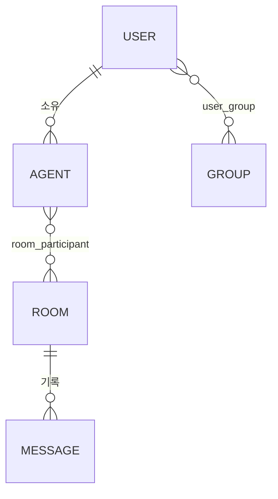

# 01. 도메인 모델

> 이 문서가 용어와 엔티티의 기준이다. 다른 문서는 여기 정의된 이름만 사용한다.

## 1. 한 줄 그림

```
사용자 ─소유─> 에이전트(CC) ─regi─> 브로커 ──발견(그룹)·전달(UUID)──> 다른 에이전트
                                        └─ room: 여러 에이전트를 모아 토론(대화 기록)
```

브로커는 **메시지를 전달하는 통로**다. 에이전트가 그 메시지로 무엇을 하는지(파일 읽기·쓰기, 구현)는 브로커 밖의 일이다(§6 제어 경계).

## 2. 엔티티



| 엔티티 | 요지 |
|--------|------|
| user | 콘솔 사용자. 관리자가 email로 생성 → 초대 → 당사자가 Google 로그인으로 수락해 활성화(초대 안 된 계정은 로그인 불가). 관리자도 user이며 사용자·그룹 관리 권한만 추가로 가진다 |
| agent | 사용자가 로컬에서 띄운 대화형 Claude Code 세션. **영속하지 않는다** — 정체성은 regi 시 브로커가 발급하는 UUID이며 레지스트리(메모리)에만 존재한다(§3.1). user가 소유. regi 시 표시용 메타(머신·작업 디렉토리·별칭·상태)를 함께 싣는다 |
| group | 발견(가시성)의 격리 단위. user는 여러 그룹에 속할 수 있다 |
| user_group | user ↔ group 관계(다대다를 잇는 레코드). 관리자가 추가·삭제한다 |
| room | 여러 에이전트를 모아 토론시키는 대화 공간. UUID를 가지며 발언은 room UUID를 대상으로 보낸다(§5). 그룹을 가로지를 수 있다 |
| room_participant | agent ↔ room 관계. 에이전트별 페르소나·산출물 지시(선택)를 가진다. agent가 영속하지 않으므로 UUID 값과 표시용 메타 스냅샷으로 참조한다 — 종료된 room을 나중에 조회할 때 발언자를 보여주는 근거 |
| message | room 안에서 오간 발언. room에 기록된다(§5). 발신자·시각을 가진다 |

**영속 대상은 user·group·user_group·room·room_participant·message다.** agent는 도메인 엔티티지만 저장되지 않는다(§3.1). **agent_token도 엔티티가 아니다** — 토큰은 JWT로 user 정체성을 담아 서명되며, 검증만으로 user를 확인한다(DB 저장·폐기 없음, §3.1).

## 3. 정체성과 격리

### 3.1 정체성 = 레지스트리

- **agent UUID** — regi 시 브로커가 발급하고 레지스트리(메모리)에만 존재한다. 계승 기반의 `machine:alias`(호스트명 기반 메모리 키)를 대체한다. 대화는 모두 UUID로 오간다.
- **레지스트리 엔트리 = `{연결핸들, 소유자(user), 노출 그룹, 메타}`** — 발견·리쥼 검증·peers 표시가 요구하는 정보를 엔트리가 직접 가진다. 수명은 연결과 같아서, agent를 DB에 두지 않으므로 누적·정리 문제가 없다.
- **토큰 = user 정체성만(JWT)** — 토큰은 "이 요청이 어느 user냐"만 담아 서명된 JWT다. 검증만으로 user를 알며 DB 조회가 필요 없다. 발급 토큰을 저장하지 않으므로 폐기(revoke)는 1차에 없다. 그룹은 DB의 user_group에서 파생하므로, user가 그룹에 들고나도 토큰 재발급이 필요 없다. 토큰의 유일한 사용처는 regi다.
- **regi 인자** — `regi(alias?, 메타?)`는 새 UUID를 발급한다(= 매번 새 에이전트). `regi(uuid)`는 리쥼이다: 그 UUID의 엔트리가 살아있으면 **토큰의 user가 엔트리 소유자와 일치할 때만** 연결을 교체하고(불일치는 거부 — 남의 세션 가로채기 방지), 엔트리가 없으면 그 UUID로 새로 등재한다. 거부 분기가 소유자 불일치 하나뿐이라 단순하다. 메타(머신·작업 디렉토리·별칭·상태)는 계승 기반의 summary 인터페이스를 확장한 것으로, peers 목록의 표시용이다.
- **리쥼의 목적은 순단 복구** — 재접속한 클라이언트가 같은 UUID로 돌아와야, 1:1이든 room이든 상대가 끊김을 모른 채 대화를 이어갈 수 있다.

### 3.2 격리 = 그룹, 그러나 "발견"만

- **그룹은 발견을 격리한다.** peers 목록에 서로 보이는 범위가 그룹이다. agent는 소유자 user가 속한 그룹 범위 안에서 노출된다. 소속은 인증으로 서버가 판정한다 — 계승 기반의 "의도만 있으면 자칭 가능" 약점을 제거한다.
- **노출 판정 = 조회 시점 교집합** — 기본 노출 의사는 "소유자의 전 그룹 추종"이고, `set_groups`는 명시 목록으로 고정한다(추종 상태에선 관리자가 그룹을 더하면 노출도 자동으로 넓어진다). peers 조회 때마다 `엔트리의 노출 의사 ∩ DB의 현재 user_group`으로 판정하므로, 관리자가 소속을 회수하면 접속 중인 에이전트의 노출도 즉시 사라진다(재접속 대기 없음). 예: u1이 g1·g2·g3에 속하면 regi된 CC는 셋 다에서 발견되고, `set_groups([g1])`로 g2·g3의 peer에게 안 보이게 할 수 있다.
- **시야 = 노출과 대칭** — 에이전트가 peers에서 보는 범위도 자기 노출 그룹 기준이다. `set_groups([g3])`한 에이전트는 이후 g3의 peer만 본다. 반면 소속 조회(list_groups)는 소유자의 현재 소속 전체와 현재 노출을 함께 보여준다 — 그룹은 토큰이 아니라 DB의 user_group에서 조회 시점에 파생하므로(§3.1), 같은 토큰이라도 관리자 변경이 즉시 반영된다.
- **웹 세션은 노출 없는 엔트리** — 사용자가 웹에서 대화를 열면 수신을 위해 레지스트리에 등재되지만, 노출 그룹이 없어 어떤 peers에도 보이지 않는다. 송신은 격리하지 않으므로 에이전트의 답장은 정상 도착한다. 에이전트가 사용자에게 먼저 말을 거는 역방향은 1차에 없다(웹 세션 엔트리는 사용자가 대화를 여는 동안만 존재).
- **송신은 격리하지 않는다.** UUID를 알면 그룹과 무관하게 대화가 된다 — 이건 불변이며, "UUID를 알아도 그룹이 다르면 차단"하는 방어는 두지 않는다. 그룹은 "누가 나를 발견하냐"이지 "누가 나에게 보내냐"가 아니다. room이 그룹을 가로지를 수 있는 것도 이 덕분 — room 참여자끼리는 UUID를 아니까 그룹이 달라도 대화된다.
- send 대상 UUID가 레지스트리(접속 중)에 없으면 `Peer not found`로 응답한다 — 오프라인이든 미존재든 결과는 같다. 이는 평범한 전달 실패이며, 별도 위장 처리가 아니다(송신을 막지 않으므로 숨길 것이 없다).

## 4. 전달과 연결

- **전달 응답 = `{ok:true}` / `{ok:false, error}`** — 브로커는 대상 UUID로 메시지를 push하고 발신자에게 성패를 응답한다(계승 기반 룰 그대로: 성공 `{ok:true}`, 실패 `{ok:false, error:"Peer not found"}`). 성패는 레지스트리에 그 UUID의 연결이 있느냐로 갈린다. 수신자가 오프라인이면 (room 밖 1:1의 경우) 유실이며, 유실을 재전송·복구·리트라이하지 않는다.
- **연결과 정체성은 레지스트리, 소속과 기록은 DB** — 살아있는 SSE 연결핸들은 그 프로세스 힙에만 존재하므로(외부 직렬화 불가) 브로커 메모리에 `UUID → 엔트리` Map으로 잡고, agent의 정체성·소유자·노출 의사·메타도 이 엔트리에 있다(§3.1). DB에는 user·group·user_group·room·room_participant·message — 소속의 권위와 대화 기록만 남는다.
- **연결 위생 (원칙 — 구현에서 구체화)** — Map이 무한히 커지거나 죽은 엔트리가 남지 않도록: ① 연결 종료(`close`/`cancel`) 시 즉시 제거, ② 유휴 타임아웃 fallback, ③ 프로세스당 연결 수 상한, ④ 연결별 미전송 큐 상한. 수치·방식은 구현 설계에서 정한다.
- **재시작 = 레지스트리 소멸** — 브로커 재시작 시 Map과 함께 모든 연결·agent 정체성이 사라진다. 세션 서버의 성질이라 불가피하며, 복구는 클라이언트 재접속으로만: 보관한 UUID로 `regi(uuid)`하면 같은 UUID로 재등재된다. 이때 엔트리가 없어 소유 검증 근거도 없으므로 선착순이다 — 이 탈취 가능성은 단순함과 맞바꾼 수용된 트레이드오프. DB의 소속·기록은 남으므로 room 대화 기록은 유지된다.

## 5. room

room은 에이전트들을 모아 토론시키는 대화 공간이며, **그 안의 대화(message)를 기록한다.** 사용자가 종료 시간을 걸어두고 자리를 비우는 것이 정상 사용이므로, 나중에 대화를 다시 볼 수 있어야 한다.

수명:
1. 사용자가 room을 만든다 — 이름, 컨텍스트(선택). 그룹을 가로질러 에이전트를 초대할 수 있다.
2. 에이전트를 room에 넣는다 — 에이전트별 페르소나·산출물 지시(선택).
3. 사용자가 시작을 지시한다.
4. 각 에이전트에게 room 정보와 페르소나가 전달되고 대화가 시작된다. 발언은 message로 기록된다. 사용자도 웹에서 보거나 참여한다.
5. 사용자가 종료 시간을 설정하거나 버튼으로 종료(폭파)한다.
6. 폭파 시 참여 에이전트에게 종료 메시지를 보내고 room을 비활성화한다.

규칙:
- **자유 형식** — 주제·역할·트리거를 정형 필드로 강제하지 않는다. 컨텍스트·페르소나·산출물 지시는 모두 선택값(자유 텍스트).
- **전체 팬아웃** — 발언은 room UUID를 대상으로 보내고, 참여자 전원에게 전달된다. 특정 상대 지정 발언은 없다. 1:1 send와는 별도 인터페이스다 — "기록되는 발언"임이 호출자에게 명시되어야 한다([04 §2](04-plugin.md)).
- **사용자 발언도 팬아웃** — 사용자가 원해서 한 행동이므로 에이전트 발언과 동급으로 뿌리고 기록한다.
- **폭파 = 대화 종료, 기록 보존.** 폭파하면 room은 비활성화되고 새 발언을 받지 않는다. 참여 에이전트는 계속 브로커에 regi된 채 남는다(다음 room에 다시 초대 가능). room과 그 대화 기록은 남아 나중에 조회할 수 있다 — 발언자 표시는 room_participant의 메타 스냅샷이 담당한다(§2).

## 6. 제어 경계

**브로커는 지시가 오가는 통로까지다.** 메시지를 받은 에이전트가 무엇을 하는지는 사용자 ↔ CC의 영역이며 브로커가 제어·관여하지 않는다.

- 에이전트는 사용자가 정한 로컬에서 구동 중이다. 역할·권한·읽기쓰기 범위는 전부 CC 설정 — 브로커는 알지 못한다.
- room · 1:1 · 로컬터미널은 **같은 에이전트에게 지시가 도착하는 세 경로**일 뿐. 컨텍스트 유지는 CC가 담당한다.
- 브로커가 기록하는 것은 **오간 대화(message)까지**다. 그 대화로 에이전트가 로컬에서 만든 산출물은 도메인 엔티티가 아니며 브로커에 저장되지 않는다.
