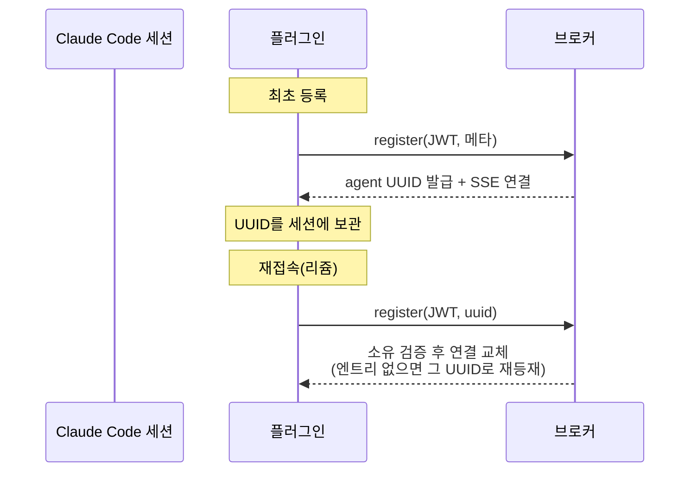

# 04. 클라이언트 플러그인 (CC)

> 에이전트(Claude Code)가 브로커에 붙는 클라이언트 관점. 브로커 관점은 [00](00-vision.md)·[01](01-domain-model.md), 계승 코드 실측은 [02 §5](02-tech-notes.md).
>
> 플러그인은 대부분 계승 기반([claude-channel-peers](https://github.com/nice1st/claude-channel-peers))을 그대로 잇는다. 이 문서는 **우리 결정 때문에 달라지는 것**을 계승과 구분해 정리한다. 멀티플랫폼(OpenCode·Codex) 도입 전까지 구조는 계승과 같다.

## 1. 구조 (순수 계승)

- **채널 서버** — 세션당 stdio로 뜨는 MCP 서버(`claude/channel` capability). Claude Code가 플러그인을 로드하며 spawn한다.
- **아웃바운드** — Claude가 도구(register·send_message 등)를 호출해 브로커에 요청한다.
- **인바운드** — 브로커 SSE → `notifications/claude/channel`로 Claude에 주입. `from_id`·`sent_at`·`skill`이 `<channel>` 태그 속성이 된다.
- **SSE 수신 루프** — `POST /register` 응답 스트림을 읽어 이벤트를 파싱하고, 메시지 이벤트를 위 알림으로 흘린다. 끊기면 사용자에게 알린다. 재등록(리쥼) 여부·시점은 클라이언트 자율이며 브로커는 관여하지 않는다.
- **skill 지시** — 수신 메시지에 skill 속성이 있으면 그 스킬을 실행하도록 지시받는다(프롬프트 수준 — 하드 보장 아님).

## 2. 도구 (계승 7종, 일부 변경)

| 도구 | 계승 | 1차 변경 |
|------|------|----------|
| `register` | alias 받아 등록, SSE 연결 | **JWT 토큰을 실어 보냄**(인증). 반환이 `machine:alias`가 아니라 **브로커 발급 UUID**. 리쥼용 `uuid?` 인자 추가. 메타(작업 디렉토리·별칭·상태) 확장 전송 |
| `send_message` | 대상에 메시지 전달(+skill) | 대상이 `machine:alias` → **UUID** |
| `set_groups` | 노출 그룹 교체(아무 그룹 자칭 가능) | 지정 목록은 **노출 의사로만 저장**된다. 실제 노출은 그중 소유자가 실제로 속한 그룹만(조회 시점 교집합 — [01 §3.2](01-domain-model.md)) — 소속에 없는 그룹은 지정해도 노출되지 않는다 |
| `list_peers` | 같은 그룹 접속자 조회 | 시야가 자기 노출 그룹 기준으로 대칭화([01 §3.2](01-domain-model.md)). 표시에 확장 메타(작업 디렉토리·별칭·상태) 포함 |
| `set_summary` | 상태 한 줄 발행 | 레지스트리 엔트리 메타 중 갱신 가능한 항목(상태·별칭)을 갱신하는 도구로 일반화(도구명은 구현에서) |
| `unregister` | 등록 해제·SSE 종료 | 계승 |
| `list_groups` | 활성 그룹 조회 | 소유자의 현재 소속 전체와 현재 노출 그룹을 함께 반환([01 §3.2](01-domain-model.md)) |

## 3. 정체성 흐름 (변경 핵심)

계승은 정체성이 `machine:alias`(플러그인이 만들어 보냄)였다. 1차는 브로커가 UUID를 발급하므로 흐름이 바뀐다.

- **UUID 보관은 플러그인 몫** — 브로커가 발급한 UUID를 세션이 들고 있다가, 재접속 시 `register(uuid)`로 되돌려 리쥼한다. 엔트리가 살아있으면 토큰의 user가 소유자와 일치할 때만 교체되고, (브로커 재시작 등으로) 없으면 그 UUID로 새로 등재된다([01 §3.1](01-domain-model.md)). 보관을 안 하거나 uuid 없이 register하면 새 에이전트가 된다.
- **토큰(JWT)의 출처** — 사용자가 웹에서 생성한 토큰([03 내 에이전트](03-ui.md))을 **환경변수로 주입**한다 — 계승의 `CLAUDE_PEERS_BROKER_URL`과 같은 전달 경로. 토큰의 사용처가 regi뿐이라 기동 시점 1회 주입으로 충분하다.

## 4. 이 문서가 정하지 않은 것

- UUID를 세션 안에서 보관하는 구체 방식(플러그인 메모리 / 파일 — 세션 재시작을 넘겨 보관할지 포함).
- 멀티플랫폼(OpenCode·Codex) 어댑터의 플러그인 대응 — 1차 범위 밖([00 §6](00-vision.md)).
