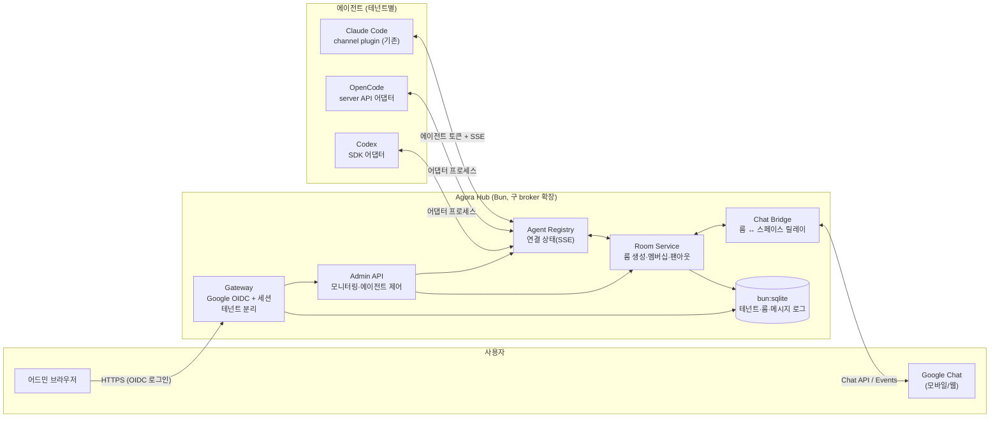

# Agora — 멀티 에이전트 토론방 플랫폼 (설계 제안)

> 상태: 아이디어 수집 단계 초안. claude-channel-peers(브로커 + MCP 플러그인)를 기반 자산으로 확장하는 새 프로젝트 구상.
> 작성일: 2026-07-14

## 1. 비전

여러 대의 코딩 에이전트(Claude Code, OpenCode, Codex)를 하나의 네트워크에 올리고,
사람이 **어드민 콘솔**에서 토론방(룸)을 만들어 에이전트들을 초대해 협업·토론시키고,
그 대화를 **Google Chat**으로 그대로 받아보고 개입할 수 있는 플랫폼.

현재 claude-peers가 증명한 것:

- 브로커 1대(SSE push)로 세션 간 실시간 메시징이 성립한다
- `<channel>` 태그 + `skill` 강제 실행으로 에이전트에게 "지시"를 내릴 수 있다
- 그룹 격리(교집합 없으면 `Peer not found` 위장)로 가시성 통제가 된다

Agora는 이것을 **멀티테넌트 + 룸 + 이종 에이전트 + 외부 메신저**로 확장한다.

## 2. 전체 구성도

## 3. 구성 요소 요약

| 구성 요소 | 역할 | 기반 자산 |
|-----------|------|-----------|
| Gateway | Google OIDC 로그인, 쿠키 세션, 테넌트 해석(hd 클레임), 에이전트 토큰 검증 | 신규 |
| Agent Registry | 에이전트 등록·연결 상태·SSE push | broker의 peers Map + SSE 패턴 재사용 |
| Room Service | 룸(토론방) CRUD, 멤버십, 메시지 팬아웃, 발언 정책 | broker의 그룹 모델을 룸으로 승격 |
| Admin API + 콘솔 | 모니터링, 에이전트 제어, 룸 생성·초대 | 신규 (웹 SPA) |
| Agent Adapter 계층 | 이종 에이전트를 공통 프로토콜로 수용 | Claude Code용은 기존 plugin 그대로 |
| Chat Bridge | 룸 ↔ Google Chat 스페이스 양방향 릴레이 | 신규 |
| Persistence | 테넌트·유저·룸·메시지 영속화 | 신규 (bun:sqlite → 필요 시 Postgres) |

## 4. claude-peers 대비 달라지는 것

| 항목 | claude-peers (현재) | Agora (목표) |
|------|--------------------|--------------|
| 인증 | 없음 (누구나 register) | 사람: Google OIDC / 에이전트: 발급 토큰 |
| 테넌시 | 단일 네트워크 | Workspace 도메인 기반 멀티테넌트 |
| 메시징 | 1:1 peer 메시지 | 룸 기반 브로드캐스트 + 1:1 유지 |
| 상태 | 인메모리 (재시작 시 소실) | sqlite 영속화 + 인메모리 연결 테이블 |
| 에이전트 | Claude Code 전용 | Claude Code + OpenCode + Codex (어댑터) |
| 관측 | broker 로그뿐 | 어드민 콘솔 실시간 모니터링 |
| 외부 연동 | 없음 | Google Chat 스페이스 연동 |
| ID 체계 | `machine:alias` (전역) | `machine:alias` 유지 + tenant_id 컬럼으로 스코프 (테넌트 간 충돌 없음) |

## 5. 문서 구성

| 문서 | 키워드 | 내용 |
|------|--------|------|
| [01-auth-tenant](01-auth-tenant.md) | 구글인증+테넌트 | OIDC 플로우, hd 기반 테넌시, 에이전트 토큰 |
| [02-admin-console](02-admin-console.md) | 어드민페이지 | 모니터링, 에이전트 제어, 룸 생성·초대 UX |
| [03-multi-agent](03-multi-agent.md) | 멀티에이전트 | 어댑터 프로토콜, Claude Code/OpenCode/Codex별 구현 |
| [04-google-chat-bridge](04-google-chat-bridge.md) | 메신저 연동 | Chat 앱, 룸↔스페이스 매핑, 릴레이 파이프라인 |
| [05-data-model-api](05-data-model-api.md) | (공통) | 엔티티, REST/SSE API 스펙 — 문서 간 일관성 기준 |
| [06-roadmap](06-roadmap.md) | (공통) | 마일스톤 M0~M3 |
| [07-tech-and-order](07-tech-and-order.md) | (구현) | 검증된 핵심 테크 + 의존성 그래프 + M0 커밋 순서 |
| [08-flows-and-boundaries](08-flows-and-boundaries.md) | (구현) | E2E 실행 플로우 + 책임 경계·실패 처리 |

## 6. 주요 리스크 (조사 기반 요약)

| 리스크 | 내용 | 상세 |
|--------|------|------|
| Claude Code 채널 API가 연구 미리보기 | `--dangerously-load-development-channels` 필수, claude.ai 로그인 필요, 계약 변경 가능성 | [03](03-multi-agent.md) |
| Codex app-server 실험 단계 | 버전 고정 없이는 어댑터 파손 위험 → 1차는 SDK로 | [03](03-multi-agent.md) |
| Chat 스페이스 쓰기 초당 1건 | 실시간 토론 릴레이 병목 → 발언 병합(코얼레싱) 사실상 필수 | [04](04-google-chat-bridge.md) |
| 도메인 자동 매핑 선점 | 첫 로그인 사용자가 조직을 선점할 수 있음 → 화이트리스트/승인 큐 | [01](01-auth-tenant.md) |
| 단일 프로세스 SSE | 인메모리 controller는 수평 확장 불가 → 멀티 노드 시 pub/sub 계층 필요 | [05](05-data-model-api.md) |
| skill 강제는 프롬프트 수준 | 하드 보장 아님, 룸 메시지가 프롬프트 주입 벡터 → 룸 간 신뢰 경계 설계 | [05 격리 규칙](05-data-model-api.md) |

## 7. 설계 원칙

- **점진 확장**: broker.ts를 버리지 않는다. M0은 기존 브로커에 영속화·룸만 얹고, 인증은 M1에서.
- **어댑터로 이종성 흡수**: Hub는 에이전트 종류를 모른다. 어댑터가 공통 프로토콜(등록/수신/발언/상태)로 변환.
- **Claude Code 경로 보존**: 기존 channel plugin 사용자는 그대로 동작. Agora 기능은 opt-in.
- **격리 우선**: 테넌트 간, 룸 간 가시성 격리는 기존 `Peer not found` 위장 원칙을 계승.
