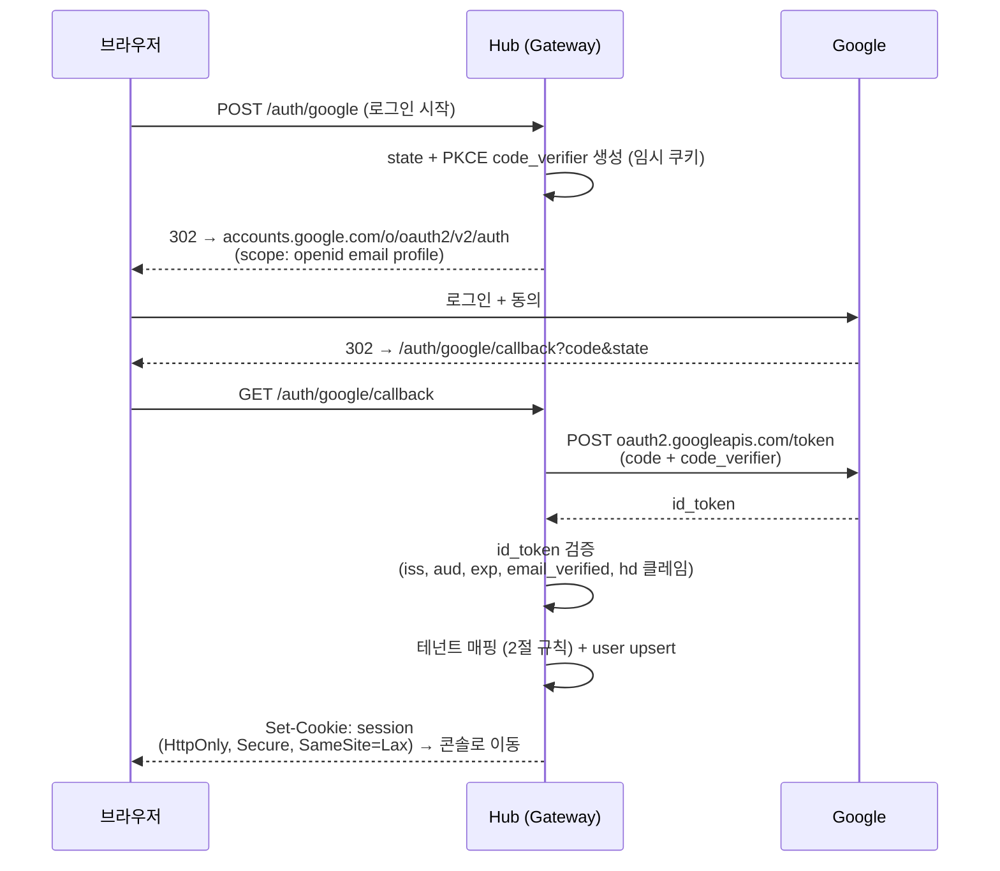
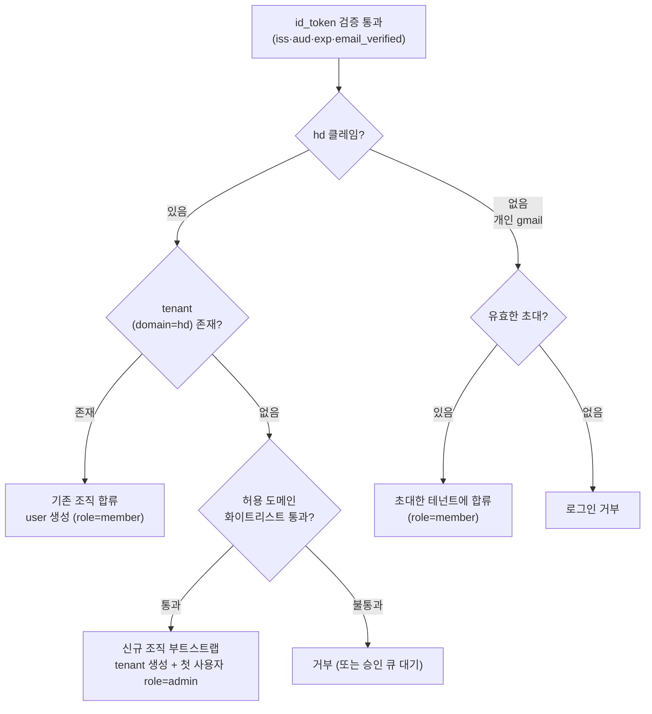

# 01. 구글 인증 + 테넌트 — OIDC 로그인 · 도메인 테넌시 · 에이전트 토큰

> 키워드: 구글인증+테넌트 (Google OIDC 로그인, Workspace 도메인 기반 테넌시, 사람/에이전트 인증 분리)
> API·엔티티는 [05-data-model-api](05-data-model-api.md) 기준. 이행 시점은 [06-roadmap](06-roadmap.md)의 M1.

## 1. 인증 개요

인증 주체는 둘이고, 서로 다른 경로를 쓴다.

- **사람(콘솔)**: Google OIDC(Authorization Code + PKCE)로 로그인 → 서버측 DB 세션 + 쿠키. 05의 `user` 엔티티.
- **에이전트(플러그인/어댑터)**: 콘솔에서 발급한 테넌트 스코프 토큰을 Bearer로 전송. 05의 `agent_token` 엔티티.

두 경로 모두 최종적으로 **tenant 하나로 해석**되고, 이후 모든 리소스 접근은 그 테넌트로 자동 스코프된다(경로에 tenant 비노출 — 05 인증 규칙).

### 콘솔 로그인 플로우

- 엔드포인트: 인가 `https://accounts.google.com/o/oauth2/v2/auth`, 토큰 `https://oauth2.googleapis.com/token`, 스코프 `openid email profile`.
- `/auth/google`은 05의 개념 경로. Better Auth 채택 시 실제 경로는 `auth.handler` 마운트 지점(`/api/auth/*`)을 따른다(4절).
- **hd는 두 곳에 존재한다는 점이 핵심**: 인가 요청의 `hd` 파라미터는 로그인 화면 필터 힌트일 뿐 신뢰할 수 없고, 서명된 `id_token` 안의 `hd` 클레임만 신뢰한다. 테넌트 매핑은 반드시 클레임 쪽으로 한다.
- **실행 검증 결과**: Better Auth는 `socialProviders.google.hd` 옵션으로 위 검증(힌트 전송 + 클레임 강제 + 불일치 거부)을 네이티브 수행한다 — 자작할 것은 hd→조직 매핑 훅뿐. 상세는 [07 §7](07-tech-and-order.md).

## 2. 테넌트 매핑 규칙

`id_token`의 `hd` 클레임(Workspace 기본 도메인)으로 분기한다. `hd` 클레임이 없으면 개인 gmail이다.

| 분기 | 조건 | 동작 | 안전장치 |
|------|------|------|----------|
| 기존 조직 합류 | `hd` 있음 + `tenant.domain=hd` 존재 | `user` 생성/조회, role=member | 같은 도메인 = 같은 테넌트라는 신뢰는 Google이 도메인 소유를 이미 검증했기에 성립 |
| 신규 조직 부트스트랩 | `hd` 있음 + tenant 없음 | tenant 생성, 첫 사용자 role=admin (05·M1의 "첫 사용자 = admin") | **자동 생성 단독은 위험** — 임의 Workspace 사용자가 조직을 선점할 수 있음. 허용 도메인 화이트리스트(env, 예: `CLAUDE_PEERS_ALLOWED_DOMAINS=rsupport.com`)를 기본으로 하고, 화이트리스트 밖은 거부 또는 승인 큐. 장기적으로 DNS TXT 소유 증명으로 확장 |
| 개인 gmail | `hd` 클레임 없음 | 도메인 자동 매핑 **금지**. admin이 보낸 유효한 초대가 있을 때만 해당 테넌트 member로 합류, 없으면 거부 | gmail.com을 테넌트로 만들면 전 세계 gmail 사용자가 한 테넌트가 되므로 원천 차단 |

주의: `hd`는 Workspace **기본 도메인만** 반영한다. 보조 도메인/별칭 계정은 다른 값이 오거나 매핑에 실패할 수 있으므로, 초기에는 초대 경로로 우회시키고 필요해지면 tenant에 도메인 별칭 목록을 추가한다(6절 리스크).

## 3. 사람 인증 vs 에이전트 인증

05의 인증 규칙 절을 그대로 따른다. 요약 비교:

| 구분 | 사람 (콘솔) | 에이전트 (플러그인/어댑터) |
|------|-------------|---------------------------|
| 신원 | Google 계정 → `user` | `agent_token` → 소속 tenant |
| 인증 수단 | 서버측 DB 세션 + 쿠키 (HttpOnly, Secure, SameSite=Lax) | `Authorization: Bearer <agent_token>` |
| API 범위 | `/api/*` | `/agent/*` |
| SSE 인증 | 쿠키 — 브라우저 `EventSource`는 커스텀 헤더를 못 붙이므로 쿠키가 유일한 답 | Bearer 헤더 — 어댑터는 fetch 기반이라 헤더 자유 |
| 즉시 폐기 | 세션 행 삭제 즉시 무효 | `revoked_at` 기록 즉시 무효 |

콘솔 세션에 JWT를 쓰지 않는 이유: JWT는 발급 후 만료 전까지 서버가 무효화할 수 없다. "이 브라우저 로그아웃시키기", "퇴사자 즉시 차단"이 안 되므로 DB 세션을 기본으로 한다.

### agent_token 발급·전달·검증 흐름

1. **발급** — admin이 콘솔에서 `POST /api/tokens` (body: `label`). 서버는 `agora_` 프리픽스 + 난수로 원문을 만들고, **해시만 저장**(`token_hash` — 05 스키마의 "원문 저장 금지"), 원문은 응답으로 **1회만 표시**(02 문서의 토큰 관리 탭과 동일). `created_by`에 발급자 user 기록.
2. **전달** — 에이전트 머신의 환경변수 `CLAUDE_PEERS_TOKEN`으로 주입(02의 복사용 커맨드 스니펫, 06 M1 체크리스트와 동일). channel plugin/어댑터가 모든 `/agent/*` 요청에 Bearer로 붙인다.
3. **검증** — Hub가 프리픽스로 후보를 좁힌 뒤 해시 비교 → `tenant_id` 해석 → 요청 전체를 그 테넌트로 스코프. **발신자 신원은 body의 from이 아니라 토큰 + 등록된 연결에서 서버가 유도한다**(05 인증 규칙 — 현재 broker의 `from_id` 자기신고를 여기서 폐기).
4. **회전** — 새 토큰 발급 → 머신의 env 교체 → 구 토큰 `DELETE /api/tokens/:id` 폐기. 토큰은 머신/용도 단위로 나눠 발급해 회전 반경을 줄인다(`label`이 그 용도).

장기적으로는 정적 토큰을 OAuth 2.1 스타일 **단기 토큰**(agent_token으로 짧은 JWT를 교환)으로 승격하는 경로를 남겨둔다(5절 단계 5).

## 4. 구현 선택 — Better Auth 권장

Lucia v3가 2025년 3월 공식 폐기되면서 신규 프로젝트의 표준 권고는 Better Auth로 이동했다. 이 프로젝트의 범위(테넌트 + 콘솔 세션 + 에이전트 토큰)를 전부 커버하는지가 선택 기준이다.

| 항목 | Better Auth (권장) | Arctic v3 + 자작 세션 |
|------|--------------------|-----------------------|
| 커버 범위 | 세션·소셜 로그인·조직·API 키 일체형 | OAuth 코드 교환만 (Lucia 저자가 유지보수) |
| Google 로그인 | `socialProviders.google` 내장 | 직접 구현, `hd` 파라미터 수동 추가 |
| 테넌시 | organization 플러그인 (조직/멤버/초대/역할, `organizationHooks`로 hd 도메인 자동 매핑 구현) | 전부 자작 |
| 에이전트 토큰 | api-key 플러그인 + bearer 플러그인 | 자작 (해시·프리픽스·회전 직접) |
| Bun 통합 | `Bun.serve`의 fetch에 `auth.handler(req)` 직접 마운트 | fetch 라우팅 자작 |
| 유지보수 리스크 | 릴리스 주기가 빨라 API 시그니처 변동 | 코드는 적지만 세션·CSRF·해시 보안 책임 전부 자작 |
| 판단 | **이 범위에는 총비용 최저** | 의존성 최소화가 최우선일 때의 대안 |

- Better Auth의 agent-auth 플러그인은 신규라 성숙도가 검증되지 않았다. 에이전트 토큰은 초기엔 **api-key 플러그인**으로 가는 것이 안전하다.
- API 변동 리스크는 버전 고정 + auth 접점을 모듈 1곳으로 격리해 흡수한다(05의 repository 분리와 같은 원칙).
- **실행 검증에서 확인된 함정 3가지**([07 §2](07-tech-and-order.md)): ① api-key는 1.4부터 별도 패키지(`@better-auth/api-key`)이고 기본 헤더가 `x-api-key`(Bearer 유지는 `customAPIKeyGetter`), ② `enableSessionForAPIKeys: true`를 켜야 키가 세션처럼 해석됨, ③ **키로 만든 세션에는 activeOrganizationId가 없다** — 에이전트 요청의 테넌트는 member 테이블 조회 또는 키 metadata(tenantId)로 해석해야 한다. 3절의 검증(프리픽스+해시)은 플러그인 내장 기능으로 충족된다.

### organization ↔ 05 엔티티 대응

Better Auth를 채택하면 **organization = 05의 `tenant`**(도메인은 organization metadata 또는 slug에 저장), **member = 05의 `user`의 테넌트 소속**으로 대응시킨다. 역할은 Better Auth가 owner/admin/member 3단계, 05가 admin/member 2단계인데, owner와 admin을 콘솔에서는 모두 `admin`으로 취급하면 05 모델이 유지된다(부트스트랩 첫 사용자 = owner = 05의 admin). hd 기반 자동 합류는 `organizationHooks`(가입/로그인 시점 훅)로 2절의 분기를 구현한다. **05의 스키마는 개념 모델이고, 실제 테이블은 Better Auth가 생성하는 스키마(user/session/account/organization/member/apikey)를 따를 수 있다** — 다른 문서가 참조하는 것은 엔티티 이름과 의미이지 물리 테이블이 아니다.

## 5. 기존 무인증 브로커에서의 단계적 이행

원칙(00-overview): broker.ts를 버리지 않고, 기존 claude-peers 사용자는 어느 시점에도 깨지지 않는다. 모드 플래그 `CLAUDE_PEERS_AUTH=off|soft|required`로 기간을 벌며 전환한다 — `soft`는 토큰이 있으면 해석하고 없어도 허용하는 관측 모드로, 전환 준비도(무토큰 비율)를 측정한다. 전환 운영 절차는 [08 플로우 E](08-flows-and-boundaries.md).

| 단계 | 내용 | 모드 | 로드맵 |
|------|------|------|--------|
| 0 | `bun:sqlite` 도입 (repository 분리) — 인증의 저장 기반 | `off` | M0 |
| 1 | `auth.handler` 마운트, 콘솔 로그인만 활성. 기존 `/register` 등 에이전트 API는 무인증 그대로 병행 | `off` (기본) | M1 |
| 2 | hd 기반 테넌트 매핑 훅 + 허용 도메인 화이트리스트 (2절) | `off` | M1 |
| 3 | 사람/에이전트 인증 분리 — `/agent/*` Bearer 필수화. 플러그인은 `CLAUDE_PEERS_TOKEN` env 지원 배포 후 전환 | `required` 전환 | M1 |
| 4 | 전 리소스 테넌트 스코프 (조회 빈 목록·전송 `Peer not found` 격리 — 05 격리 규칙) | `required` | M1 |
| 5 | 정적 토큰 → 단기 JWT 승격 (agent_token으로 짧은 수명 토큰 교환, OAuth 2.1 방향) | `required` | M1 이후 |

단계 1~4가 [06-roadmap](06-roadmap.md) M1 체크리스트에 그대로 대응한다. 단계 3의 `required` 전환 전에 플러그인 배포(env 지원 버전)가 충분히 퍼질 기간을 둔다 — 전환 즉시 구버전 플러그인 세션은 전부 끊기기 때문이다.

## 6. 리스크

| 리스크 | 내용 | 대응 |
|--------|------|------|
| hd 파라미터 오신뢰 | 인가 요청의 `hd` 파라미터는 화면 힌트일 뿐 위조 가능 | 매핑은 반드시 서명된 id_token의 `hd` 클레임으로. `iss`/`aud`/`exp`/`email_verified` 함께 검증 |
| 조직 선점 탈취 | "첫 사용자 = admin" 부트스트랩과 도메인 자동 생성이 결합하면 임의 Workspace 사용자가 남의 조직 자리를 선점 | 허용 도메인 화이트리스트(env) 기본, 그 외 승인 큐. 장기: DNS TXT 소유 증명 |
| hd 보조 도메인 누락 | `hd`는 Workspace 기본 도메인만 반영 — 보조 도메인/별칭 사용자는 매핑 실패 | 초기엔 초대 경로로 우회, 필요 시 tenant 도메인 별칭 목록 추가 |
| 개인 gmail 유입 | `hd` 없는 계정을 자동 매핑하면 테넌시가 무너짐 | 초대 수락만 허용 (2절) |
| Better Auth API 변동 | 릴리스 주기가 빨라 시그니처가 바뀔 수 있음 | 버전 고정 + auth 접점 모듈 1곳 격리 |
| 구버전 플러그인 단절 | `/agent/*` 인증 필수화 시 토큰 미지원 세션 전부 끊김 | `off→soft(관측)→required` 3단계 + 신규 register만 거부·기존 연결 24h 유예 ([08 플로우 E](08-flows-and-boundaries.md)) |
| JWT 콘솔 세션 | JWT는 즉시 폐기 불가 — 로그아웃·차단이 안 됨 | 콘솔은 DB 세션 채택 (3절) |
