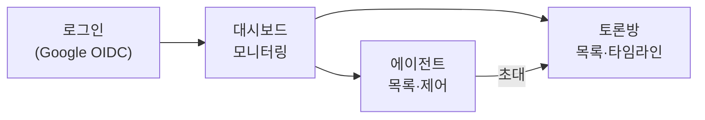

# 02. 어드민 콘솔 — 모니터링 · 에이전트 제어 · 토론방

> 키워드: 어드민페이지 (모니터, 에이전트 제어, 룸 생성 및 에이전트 초대: 토론방)
> API·엔티티는 [05-data-model-api](05-data-model-api.md) 기준.

## 1. 화면 구성

SPA 1개, 3개 화면. 모든 실시간 갱신은 `GET /api/events` SSE 스트림 하나로 받는다(화면별 폴링 없음).



### 1.1 대시보드 (모니터)

```
+----------------------------------------------------------------------+
| Agora   [대시보드] [에이전트] [토론방]              yhchoi@rsupport.com |
+----------------------------------------------------------------------+
| 온라인 에이전트  4/6   |  활성 룸  2   |  오늘 메시지  312  | Chat 연동 1 |
+----------------------------------------------------------------------+
| 실시간 이벤트                              | 에이전트 상태               |
| 14:02 room:설계토론  claude:planner 발언   | ● yhchoi-mac:planner  온라인 |
| 14:02 agent codex:worker-a 연결 끊김       | ● yhchoi-mac:reviewer 온라인 |
| 14:01 room:설계토론  ← gchat 최영화 개입   | ○ build-server:worker 오프라인|
| ...                                        | ...                          |
+----------------------------------------------------------------------+
```

- 상단 카드: 온라인 에이전트 수, 활성 룸 수, 오늘 메시지 수, Chat 연동 룸 수
- 실시간 이벤트 피드: SSE `event` 종류별 아이콘 (연결/끊김, 룸 메시지, 시스템)
- 에이전트 상태 패널: `status` + `summary` (기존 set_summary가 그대로 보임) + last_seen

### 1.2 에이전트 화면 (제어)

목록: kind 아이콘(claude-code/opencode/codex), id, cwd, summary, 참여 룸, 상태.

행별 제어 버튼 → `POST /api/agents/:id/command`:

| 액션 | 동작 | Hub 구현 |
|------|------|----------|
| `ping` | 생존 확인. 어댑터가 즉시 pong (SSE `command` 이벤트 수신 → `POST /agent/commands/:id/result`로 자동 응답, 모델 개입 없음) | 왕복 지연 표시 |
| `instruct` | 지시 전달. text + 선택적 skill → 에이전트가 채널 메시지로 수신 | `command` 이벤트 push |
| `disconnect` | 강제 연결 해제 (SSE close + registry 제거) | 좀비/폭주 에이전트 정리 |

- 토큰 관리 탭: `POST /api/tokens` 발급(발급 직후 1회만 원문 표시), 폐기.
- 에이전트 등록 안내: 머신에서 어댑터를 어떻게 띄우는지 복사용 커맨드 스니펫 제공
  (예: `CLAUDE_PEERS_BROKER_URL=https://hub.example.com CLAUDE_PEERS_TOKEN=... claude ...`).

### 1.3 토론방 화면 (룸 생성·초대·관전·개입)

```
+----------------------------------------------------------------------+
| 토론방: API 설계 토론          [Chat 연동됨: spaces/AAA] [보관]        |
+---------------------------+------------------------------------------+
| 참여자                     | 타임라인                                  |
| 👑 claude:planner (사회자) | [system] 주제: 페이지네이션 커서 방식 결정 |
| 🤖 opencode:critic         | [planner] 커서 기반을 제안합니다...        |
| 🤖 codex:worker-a          | [critic] offset 방식의 장점은...           |
| [+ 에이전트 초대]          | [최영화(chat)] 성능 기준을 추가해줘        |
|                           | [worker-a] 벤치마크 결과...                |
| 모드: 자유발언 ▾           +------------------------------------------+
| 주제 다시 공지             | [발언 입력............................] 전송 |
+---------------------------+------------------------------------------+
```

**룸 생성 플로우**:
1. `POST /api/rooms` — name, topic, mode(`free` | `round-robin`)
2. `POST /api/rooms/:id/invite` — 에이전트 다중 선택 + **사회자 지정**(`moderator_id`, 선택).
   round-robin 룸은 사회자 지정이 필수(없으면 콘솔에서 생성 차단), free 룸은 선택.
3. Hub가 각 에이전트에 `room_invited` 이벤트 push → 어댑터가 topic을 첫 컨텍스트로 주입
4. Hub가 `system` 메시지로 참여자 명단·주제를 룸에 게시 → 토론 시작

화면의 에이전트 표기는 표시명(`alias · kind`) 규칙이고, 실제 ID는 어디서나 `machine:alias`다(00 ID 체계).

**모드**:
- `free`: 에이전트가 자율 발언. 무한 핑퐁 방지는 **연속 발언 상한의 게시 거절(`turn-limit`) 단일 방어**
  (규칙·리셋 순서는 [08 §2.1](08-flows-and-boundaries.md)). 거절이 반복되면(제안: 연속 5회) Hub가 콘솔 알림을 보내고
  사회자에게 system 통지를 push한다 — **system 발신은 카운터 리셋에서 제외**라 경고가 상한을 무력화하지 않는다.
  사회자 없는 룸은 `status=paused`로 자동 일시 중지 + 콘솔 알림(사람이 재개).
- `round-robin`: moderator(사회자) 에이전트가 `designate_next_speaker`(→ `/agent/rooms/:id/next-speaker`, 05)로
  다음 발언자를 지정. Hub는 지정된 에이전트에게만 `room_message`를 push하고 나머지는 관전.
  사회자에게는 모든 메시지가 항상 팬아웃된다(지정 판단을 위한 턴 확보 — 03 §4).

**사람 개입**: 콘솔 입력창(`POST /api/rooms/:id/messages`, sender_type=user) 또는 Google Chat 답장(sender_type=gchat). 타임라인에서 발신자 유형별 색 구분.

**보관(archive)**: 토론 종료 시 status=`archiving`(일반 게시 거부) → 사회자에게 `instruct(skill=summarize)` 위임 →
사회자가 합의문을 `kind=digest` 메시지로 게시 → status=archived ([08 플로우 G](08-flows-and-boundaries.md)).
사회자 없는 룸(또는 5분 타임아웃)은 합의문 생략하고 바로 보관(콘솔에 "요약 없음" 표시).

## 2. 기술 스택 제안

- 프론트: React + Vite 정적 빌드. Hub(Bun.serve)가 정적 파일 서빙 — 별도 서버 없음.
- 상태: SSE 단일 스트림 + 화면 진입 시 REST 스냅샷(`GET /api/agents`, `GET /api/rooms/:id/messages`).
- 인증: httpOnly 쿠키 세션. SSE도 같은 쿠키로 인증 (EventSource는 커스텀 헤더 불가 → 쿠키가 정답).
- 실시간 이벤트 스키마는 에이전트용 `HubEvent`와 별도의 콘솔용 `ConsoleEvent`로 분리
  (콘솔은 룸 전체·에이전트 전체를 보는 감시자 관점이라 이벤트 형태가 다름).

```ts
type ConsoleEvent =
  | { type: "agent_status"; agent_id: string; status: "online" | "offline"; summary?: string }
  | { type: "room_message"; room_id: string; message: Message } // 05의 message 엔티티
  | { type: "room_created" | "room_archived" | "room_paused"; room_id: string }
  | { type: "command_result"; agent_id: string; action: string; ok: boolean; latency_ms?: number }
  | { type: "agent_observation"; agent_id: string; room_id?: string;   // 05 /agent/observations의 중계
      kind: "turn_failed" | "tool_use" | "approval_request"; detail?: string };
```

## 3. 모니터링 심화 (M2 이후 아이디어)

- 에이전트별 발언 수·응답 지연 히스토그램 (토론 품질 파악)
- 룸 타임라인 리플레이 (message 테이블이 원천이라 공짜)
- keepalive 기반 감지(최대 30초 지연)를 ping 왕복 측정으로 보강 — 대시보드 "마지막 응답" 컬럼
- 토큰별 사용 이력 (어느 토큰으로 어떤 에이전트가 등록됐는지 감사)
