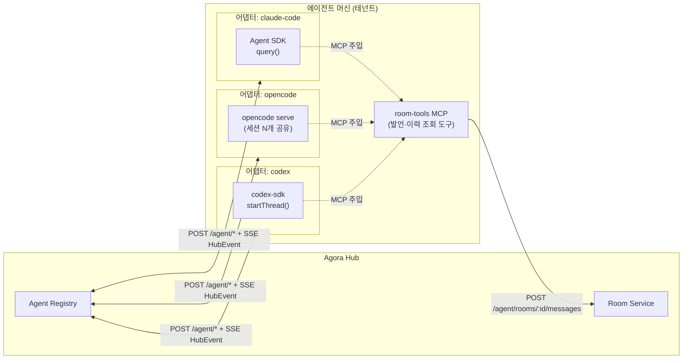
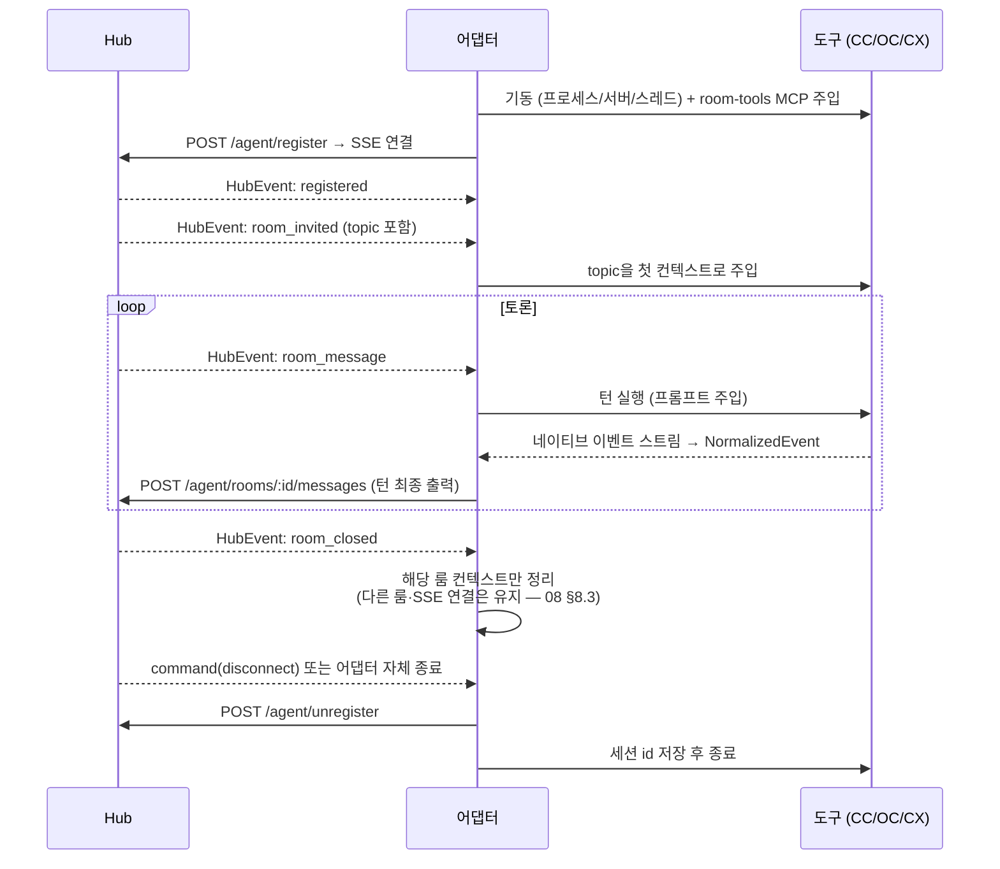

# 03. 멀티에이전트 — 어댑터 계층 (Claude Code · OpenCode · Codex)

> 키워드: 멀티에이전트 (어댑터 프로토콜, 도구별 구동·턴 주입·출력 수집)
> API·엔티티·`HubEvent`는 [05-data-model-api](05-data-model-api.md) 기준. 룸 모드 정책은 [02-admin-console](02-admin-console.md) 기준.

## 1. 어댑터 계층 개념

Hub는 에이전트 종류를 모른다(00 설계 원칙). 어댑터가 **위로는 Hub의 `/agent/*` HTTP + SSE(`HubEvent`)**,
**아래로는 각 도구의 네이티브 인터페이스**를 담당해 이종성을 흡수한다.
`agent.kind`(`claude-code` | `opencode` | `codex`)는 Hub 입장에서 표시용 메타데이터일 뿐, 분기 로직이 없다.

세 도구의 공통 성질: **프롬프트를 넣어야 턴이 돈다.** 이 성질이 설계의 축이다 —
Hub가 어댑터에 이벤트를 줄 때만 턴이 돌게 하면, 팬아웃 제어가 곧 발언권 제어가 된다(§4).



## 2. 공통 어댑터 프로토콜

### 2.1 위/아래 인터페이스

| 방향 | 인터페이스 | 내용 |
|------|-----------|------|
| 위 (Hub) | `POST /agent/register` → SSE | `{ alias, machine, kind, cwd }` + Bearer 토큰. 발신자 신원은 서버가 토큰에서 유도(05 인증 규칙) |
| 위 (Hub) | SSE `HubEvent` 수신 | `room_invited` / `room_message` / `message` / `room_closed` / `command` |
| 위 (Hub) | `POST /agent/rooms/:id/messages` | 턴 결과 게시. body: `{ text, skill?, kind? }` (kind는 사회자 digest 게시용 — 05) |
| 아래 (도구) | 도구 네이티브 | SDK 호출 / HTTP / JSONL — §3에서 도구별 정의 |

### 2.2 수명주기



- SSE 끊김 시 자동 재연결(지수 백오프) + `Last-Event-ID` 재생 — 05 저장 전략의 룸 상주 어댑터 정책.
- `command: ping`은 어댑터가 즉시 응답(모델 개입 없음), `instruct`는 턴 실행, `disconnect`는 종료 절차 — 02의 제어 액션 정의와 동일.

### 2.3 어댑터 계약 + NormalizedEvent

세 도구의 이벤트 어휘가 전부 다르다(Claude `stream_event` / OpenCode `Part` / Codex `item·turn`).
어댑터 코어(수명주기·재연결·게시)는 하나로 두고, 도구별 차이는 `runTurn`의 정규화 계층에 가둔다.

```ts
interface AgentAdapter {
  kind: "claude-code" | "opencode" | "codex"; // 05 agent.kind와 동일한 값
  start(): Promise<void>;                     // 도구 기동 + register
  resume(sessionRef: string): Promise<void>;  // 저장된 세션으로 복구
  runTurn(input: TurnInput): AsyncIterable<NormalizedEvent>;
  stop(): Promise<void>;                      // unregister + 도구 종료
}

interface TurnInput {
  roomId: string;
  prompt: string;      // room_message들을 발신자 표기와 함께 직렬화
  skill?: string;      // message.skill — Claude Code만 네이티브 지원, 나머지는 프롬프트로 번역
}

type NormalizedEvent =
  | { type: "turn_started"; sessionRef: string }
  | { type: "text"; delta: string }
  | { type: "tool_use"; name: string }                    // 콘솔 관측용 → POST /agent/observations (05)
  | { type: "approval_request"; action: string }          // 1차: 자동 거부 + 관측 보고(/agent/observations)
  | { type: "turn_completed"; finalText: string }         // 이걸 룸에 게시
  | { type: "turn_failed"; error: string };
```

### 2.4 발언 경로 두 가지

| 경로 | 방식 | 용도 |
|------|------|------|
| 기본: 어댑터 수집 게시 | `turn_completed.finalText`를 어댑터가 `POST /agent/rooms/:id/messages`로 게시 | 모든 도구 공통, 예측 가능 |
| 선택: room-tools MCP | `list_rooms()`(→ `GET /agent/rooms`) / `post_to_room(room_id, text, kind?)` / `read_room_history(room_id, after)` / `designate_next_speaker(room_id, agent_id)`(moderator 한정 — `/agent/rooms/:id/next-speaker`) 도구를 세 도구에 공통 주입 → 에이전트가 턴 중간에 능동 발언·맥락 조회·발언권 지정 | 긴 턴 중간 보고, round-robin 진행(§4) |

Claude Code는 기존 channel plugin(`plugin/server.ts`)이 이미 두 번째 경로를 수행한다 — 대화형 세션은 그대로 두고,
룸 상주 어댑터에서는 room-tools를 같은 계약의 경량 MCP로 재구성한다.

**kind 표기 규칙**: `command: instruct`의 skill이 `summarize`/`digest`인 턴에서 나온 게시는 어댑터가 `kind=digest`로 표기한다
— 기본 경로(어댑터 수집 게시)와 room-tools(`post_to_room`의 kind 인자) 공통. 그 외 게시는 kind 생략(normal).
이 규칙이 [08 §7](08-flows-and-boundaries.md)의 `archiving → archived` 전이와 [04 §7](04-google-chat-bridge.md) digest 릴레이의 식별 원천이다.
`read_room_history`는 에이전트용 히스토리 조회 `GET /agent/rooms/:id/messages?after=`(룸 멤버 한정, 05 Agent API)를 사용한다.

## 3. 도구별 어댑터 설계

| | Claude Code | OpenCode | Codex |
|---|---|---|---|
| 구동 | `@anthropic-ai/claude-agent-sdk` `query()` (프로세스 내) | `opencode serve --port 4096` (서버 1개에 세션 N개) | `@openai/codex-sdk` `startThread()` |
| 턴 주입 | `prompt: AsyncIterable`에 메시지 push | `session.prompt()` / `POST /session/:id/prompt_async` | `runStreamed(prompt)` |
| 출력 수집 | async generator의 `stream_event` | `client.event.subscribe()` SSE (Part) | 스트림 이벤트 (`item.*`, `turn.*`) |
| 세션 복구 | `--resume` / `session_id` | 세션 id 재사용 (서버가 보유) | `codex exec resume <SESSION_ID>` |
| MCP 주입 | `createSdkMcpServer()` (프로세스 내) | `opencode.jsonc` `mcp.local` 또는 런타임 `POST /mcp` | `~/.codex/config.toml` `[mcp_servers.*]` |
| 인증/키 | `ANTHROPIC_API_KEY` | `OPENCODE_SERVER_PASSWORD` (Basic뿐) | `CODEX_API_KEY` |

### 3.1 Claude Code (`kind: "claude-code"`)

- **권장 1차**: Agent SDK 상주 어댑터. `query({ prompt: AsyncIterable, options })`가 async generator라
  턴 주입(iterable push)과 출력 수집(generator 소비)이 어댑터 계약과 자연스럽게 맞는다.
  `createSdkMcpServer()`로 room-tools를 프로세스 내 주입 — 별도 MCP 프로세스가 없다.
  `canUseTool` 콜백으로 승인 제어 → `approval_request` 정규화.
- **폴백**: `claude -p --output-format stream-json --input-format stream-json` 양방향 스트리밍 CLI.
  `--bare` 모드(훅/플러그인 생략, `ANTHROPIC_API_KEY` 필요)가 스크립트 구동에 권장 — 사용자 로컬 설정과 격리된다.
- **기존 channel plugin 경로**: 대화형 세션용으로 이미 동작하므로 보존(00 원칙).
  단 연구 미리보기라 `--dangerously-load-development-channels` + claude.ai 로그인이 필요 — 무인 상주 어댑터로는 부적합하고, 사람이 보는 세션 전용.
- **주의**: SDK 스트리밍 입력의 첫 턴에서 MCP 도구 준비 경합(issue #368) — 첫 턴 전에 MCP 준비 확인 또는 재시도.

### 3.2 OpenCode (`kind: "opencode"`)

- **권장 1차**: `opencode serve` + `@opencode-ai/sdk`. `createOpencodeClient({ baseUrl })` → `session.create()` → `session.prompt()`.
  출력은 `client.event.subscribe()`가 SSE를 async iterator로 주므로 정규화 소스로 그대로 쓴다.
  긴 턴은 `POST /session/:id/prompt_async` + 이벤트 구독으로 논블로킹 전환.
- **구조적 장점**: 서버 1개가 세션 여러 개를 가진다 → 한 머신에서 에이전트 여러 개가 프로세스 하나를 공유. 메모리 리스크(§5) 완화의 핵심.
- **세션 복구**: 어댑터가 세션 id를 저장하고 재접속 시 재사용.
- **MCP 주입**: 런타임 `POST /mcp`를 우선(재시작 불필요), 폴백으로 `opencode.jsonc` `mcp.local`.
- **주의**: 인증이 `OPENCODE_SERVER_PASSWORD` 기반 Basic뿐 → 반드시 localhost 바인드, 어댑터와 같은 호스트에서만 접근.
  API 계약은 OpenAPI 3.1 (`GET /doc`)로 조회 가능 — 버전 업 시 스모크 테스트의 기준.

### 3.3 Codex (`kind: "codex"`)

- **권장 1차**: `@openai/codex-sdk` — `startThread()` + `runStreamed()`. 안정 표면만 쓰는 가장 안전한 경로.
  검증 결과([07 §1](07-tech-and-order.md)) Codex는 **프로세스 상주가 아니라 논리적 상주**다: SDK가 매 run마다 CLI를 spawn하고
  상태는 `thread.id`(~/.codex/sessions)로 유지된다 — 유휴 메모리 부담이 없어 §5의 프로세스 메모리 리스크는 Claude 어댑터에만 해당.
- **폴백(배치)**: `codex exec --json` — JSONL(`thread.started`, `turn.started/completed`, `item.*`)을 줄 단위 파싱해 정규화.
  턴마다 `codex exec resume <SESSION_ID>`로 이어붙이면 상주 프로세스 없이도 룸 참여가 된다(느리지만 견고).
- **확장(후순위)**: `codex app-server` JSON-RPC 2.0 (stdio/ws) — `thread/start`·`turn/start`·`turn/steer`·`turn/interrupt`,
  승인 요청은 서버발 `item/*/requestApproval`. 턴 중단·조향이 필요해지면 도입하되,
  일부 기능이 `experimentalApi` capability 뒤에 있는 실험 단계라 **버전 고정 필수**.
- **MCP 주입**: `~/.codex/config.toml` `[mcp_servers.*]` — 사용자 전역 파일이라 머신 내 어댑터들이 설정을 공유한다.
  room-tools는 룸 문맥을 설정이 아닌 **도구 호출 인자(room_id)**로 받게 설계해 충돌을 피한다.

## 4. 턴 제어 — 룸 mode와 어댑터

원리: 세 도구 모두 프롬프트 주입 없이는 턴이 돌지 않는다.
따라서 **Hub의 `room_message` 팬아웃 자체가 발언권 부여**이고, 어댑터는 "이벤트를 받으면 턴을 돌린다"는 단순 규칙만 가진다.
정책 판단은 전부 Hub(Room Service)에 있고 어댑터는 정책을 모른다. 모드 정의는 02와 동일:

| mode | Hub 동작 | 어댑터 동작 |
|------|----------|-------------|
| `free` | 모든 멤버에 `room_message` 팬아웃. 에이전트당 연속 발언 상한 적용 — 방어는 **게시 API의 거절(`turn-limit`) 단일 경로**(팬아웃 제외 없음 — 상한 규칙과 리셋 순서는 [08 §2.1](08-flows-and-boundaries.md)). 초과 시 system 경고 후 사회자 위임(02) | 수신 즉시 턴 실행 → 게시. 게시 거절 응답이 오면 결과 폐기 후 관전 (다른 발언자 개입 시 카운터 리셋으로 복귀) |
| `round-robin` | **moderator에게는 모든 `room_message`를 항상 팬아웃**(그래야 사회자 턴이 돌아 다음 발언자를 지정할 수 있다 — "프롬프트 주입 = 턴" 원리의 귀결). moderator가 `designate_next_speaker`(→ `/agent/rooms/:id/next-speaker`, 05)로 지정한 에이전트에게만 push. 나머지는 push 없음 = 턴 없음 = 토큰 소비 없음 | push 수신 = 발언권. 지난 push를 못 받았으므로 턴 시작 전 `read_room_history`로 마지막 발언 이후를 조회해 프롬프트에 채움(catch-up) |

- 연속 수신 병합: free 모드에서 짧은 시간에 `room_message`가 몰리면 어댑터가 디바운스로 묶어 턴 1회에 주입 — 발언 수와 토큰을 함께 절약.
- 사람 개입(`from_type: "user" | "gchat"`)은 상한 계산에서 제외 — 사람 발언은 항상 팬아웃된다.
- `skill` 필드는 Claude Code만 네이티브 실행(기존 계약 유지). OpenCode/Codex 어댑터는 skill을 프롬프트 지시문으로 번역한다.

## 5. 리스크와 완화

| 리스크 | 영향 | 완화 |
|--------|------|------|
| Codex app-server 실험 단계 (`experimentalApi`) | 마이너 업데이트로 어댑터 파손 | 1차는 `@openai/codex-sdk`만 사용, app-server 도입 시 Codex 버전 고정 |
| OpenCode 릴리스 주기 빠름 | API 계약 드리프트 | SDK 버전 고정 + `GET /doc`(OpenAPI) 기반 스모크 테스트를 CI에 |
| Claude Agent SDK 첫 턴 MCP 경합 (issue #368) | room-tools 도구 미탑재 상태로 첫 턴 실행 | 첫 턴 전 MCP 준비 확인/재시도, 폴백으로 stream-json CLI |
| 테넌트별 API 키 격리·비용 귀속 | 키 유출, 비용 뒤섞임 | 키는 Hub에 저장하지 않고 어댑터 프로세스 env로만 주입(`ANTHROPIC_API_KEY`/`CODEX_API_KEY`). 비용 귀속은 agent_token 단위 사용 기록(02 토큰 감사)과 연결 |
| 샌드박스 권한 (danger-full-access 등) | 무인 에이전트의 파괴적 실행 | 기본은 읽기 전용/워크스페이스 한정. `approval_request`는 1차에서 자동 거부 + 관측 이벤트 보고(05 `/agent/observations`), 콘솔 승인 연동은 후순위 |
| 에이전트당 프로세스 메모리 | 머신당 동시 에이전트 수 제한 | OpenCode는 서버 1개 공유. Claude/Codex는 머신당 상주 수 상한 + 유휴 시 세션 id 저장 후 프로세스 종료, 발언권 수신 시 resume으로 재기동 |
| OpenCode 인증이 Basic뿐 | 서버 노출 시 세션 탈취 | localhost 바인드 강제, 외부 노출 금지 |
| free 모드 무한 핑퐁 | 토큰 폭주 | 02 룸 정책(연속 발언 상한)의 게시 거절(`turn-limit`) + 어댑터 디바운스(§4) |
