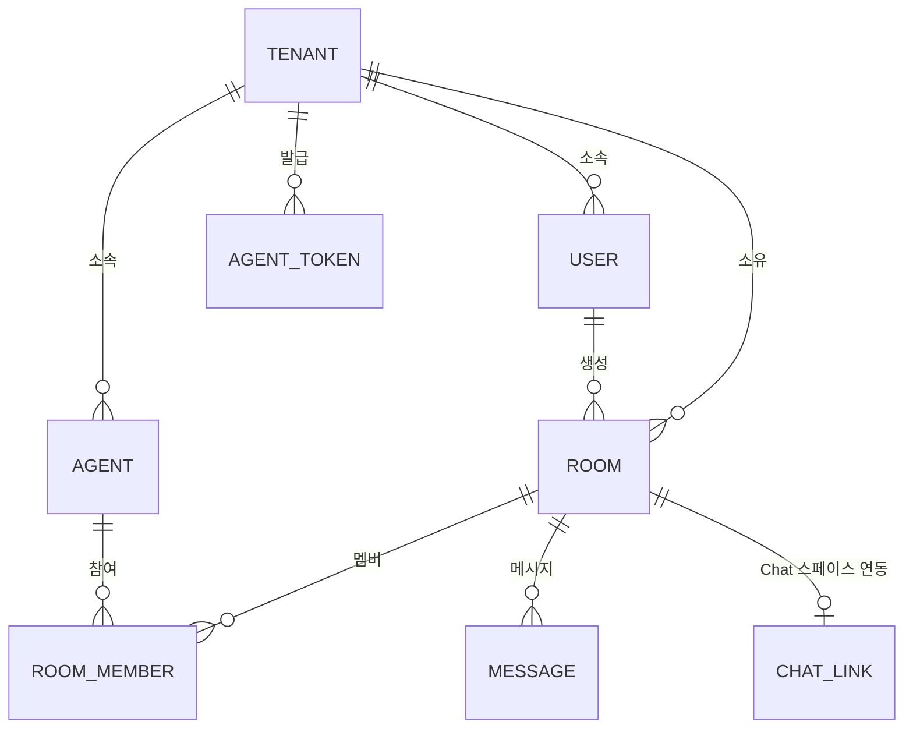

# 05. 데이터 모델 + API 스펙

> 다른 문서(01~04)는 이 문서의 엔티티 이름과 API 경로를 기준으로 작성한다.

## 1. 엔티티



### tenant
| 필드 | 타입 | 설명 |
|------|------|------|
| id | text (uuidv7) | PK |
| domain | text unique | Workspace 도메인 (예: `rsupport.com`). 개인 gmail은 별도 정책 |
| name | text | 표시명 |
| created_at | text (ISO) | |

### user (사람 — 어드민 콘솔 사용자)
| 필드 | 타입 | 설명 |
|------|------|------|
| id | text (uuidv7) | PK |
| tenant_id | text FK | |
| email | text unique | Google 계정 |
| role | text | `admin` \| `member` (테넌트 첫 사용자 = admin). Better Auth organization 채택 시 owner/admin은 콘솔에서 모두 admin으로 취급 — [01](01-auth-tenant.md) |
| created_at | text | |

### agent (에이전트 — 등록된 코딩 에이전트 인스턴스)
| 필드 | 타입 | 설명 |
|------|------|------|
| id | text | PK. `machine:alias` — **M0는 전역 유일**. 테넌트 내 유일((tenant_id, machine, alias) 유니크)로의 전환은 M1에서 테이블 재작성 마이그레이션으로 수행 — nullable tenant_id에 유니크를 선반영하면 무의미해서 금지([07 §5 커밋 1](07-tech-and-order.md)). 재작성 후 형태: PK는 대리키(uuid), `machine:alias`는 테넌트 스코프 주소 컬럼으로 강등, room_member.agent_id·message.sender_id는 같은 마이그레이션에서 대리키 참조로 재작성(테넌트 간 동명 충돌로부터 참조 무결성 보호). API·화면에서 보이는 ID는 그대로 `machine:alias`(테넌트 안에서 해석) |
| tenant_id | text FK | |
| kind | text | `claude-code` \| `opencode` \| `codex` |
| machine | text | 정규화된 호스트명 |
| alias | text | 정규화된 별칭 |
| cwd | text | 작업 디렉토리 |
| summary | text | 상태 요약 (기존 set_summary) |
| status | text | `online` \| `offline` (연결 테이블에서 파생, DB에는 last_seen) |
| last_seen_at | text | |
| created_at | text | |

### agent_token
| 필드 | 타입 | 설명 |
|------|------|------|
| id | text | PK |
| tenant_id | text FK | |
| token_prefix | text | 토큰 앞 8자 — 조회 후보 축소 + 콘솔 표시용 |
| token_hash | text | 발급 토큰의 해시 (원문 저장 금지) |
| label | text | 용도 표시 (예: "yhchoi-mac 공용") |
| created_by | text FK user | |
| created_at | text | |
| revoked_at | text nullable | |

### room (토론방)
| 필드 | 타입 | 설명 |
|------|------|------|
| id | text (uuidv7) | PK |
| tenant_id | text FK | |
| name | text | open 룸은 활성 상태에서 이름 유일 (부분 유니크 인덱스) |
| topic | text | 토론 주제 (룸 생성 시 첫 시스템 메시지로 각 에이전트에 전달) |
| mode | text | `free`(자유 발언) \| `round-robin`(사회자 지정 순서) |
| kind | text | `normal`(콘솔 초대 전용) \| `open`(에이전트 자가 참여 — 기존 set_groups 호환·머신 기본 룸, [06 M0](06-roadmap.md)) |
| status | text | `active` \| `paused`(free 폭주 자동 중지 — 사람이 재개, [02](02-admin-console.md)) \| `archiving`(요약 대기 — digest만 게시 허용) \| `archived` ([08 §7](08-flows-and-boundaries.md)) |
| created_by | text FK user | |
| created_at | text | |

### room_member
| 필드 | 타입 | 설명 |
|------|------|------|
| room_id | text FK | |
| agent_id | text FK | |
| role | text | `participant` \| `moderator` |
| invited_at | text | |

### message
| 필드 | 타입 | 설명 |
|------|------|------|
| id | text | PK — `Bun.randomUUIDv7()` (전역 식별자). **정렬·커서는 이 값이 아니라 seq 사용** — 스모크에서 동일 ms 단조성 위반 확인([07 §1](07-tech-and-order.md)) |
| (seq) | integer | sqlite 암묵 rowid — 삽입 순서. `after` 커서, SSE `id:` 필드, Last-Event-ID의 실체 |
| room_id | text FK nullable | 1:1 메시지는 null (룸 없이 저장 — 재생·감사 로그 포함) |
| sender_type | text | `agent` \| `user` \| `system` \| `gchat` |
| sender_id | text | agent id, user id, 또는 Chat 사용자 표시명 |
| to_id | text nullable | 1:1 메시지의 수신자 (room_id null인 행의 재생·감사에 필요) |
| kind | text | `normal`(기본) \| `digest`(사회자의 구간 요약 — Chat Bridge digest 모드가 이 값으로 릴레이 대상 식별, [04](04-google-chat-bridge.md)) |
| text | text | |
| skill | text nullable | 수신 에이전트가 실행할 스킬 (기존 계약 유지) |
| created_at | text | |

### chat_link (룸 ↔ Google Chat 스페이스)
| 필드 | 타입 | 설명 |
|------|------|------|
| room_id | text FK PK | |
| space_name | text | Chat API 리소스 이름 (`spaces/XXX`) |
| mode | text | `mirror`(전체 중계) \| `digest`(요약만) |
| subscription_name | text nullable | Workspace Events API 구독 리소스 이름 (`subscriptions/XXX`) — 갱신·삭제 키 |
| expire_time | text nullable | 구독 만료 시각 — 갱신 워커의 스케줄 기준 (최대 7일 TTL) |
| relay_cursor | integer nullable | 마지막 릴레이 성공 message seq — Bridge 재시작 복구의 재생 기점 ([08 §4](08-flows-and-boundaries.md)) |
| thread_map | text (JSON) | Bridge가 발급한 threadKey ↔ Chat `thread.name` 매핑 — 인바운드 스레드 답장의 룸 문맥 해석용 |
| created_at | text | |

## 2. API 스펙

### 인증 규칙
- 사람(콘솔): 쿠키 세션 (`/auth/google` → OIDC → `session` 쿠키 — 개념 경로. Better Auth 채택 시 실제로는 `/api/auth/*` 마운트). 모든 `/api/*`에 필요.
- 에이전트(어댑터): `Authorization: Bearer <agent_token>`. `/agent/*` 전용.
  Better Auth api-key 채택 시 기본 헤더는 `x-api-key`이고, **키 기반 세션에는 활성 조직이 없으므로 테넌트는 member 테이블
  또는 키 metadata에서 해석**한다 (실행 검증 — [07 §2](07-tech-and-order.md)).
- 모든 리소스는 토큰/세션에서 해석된 tenant로 자동 스코프. 경로에 tenant를 노출하지 않는다.
- **발신자 신원은 항상 서버가 유도한다.** 현재 broker는 `from_id`를 요청 body로 받는데(자기신고 — 위조 가능),
  Agora에서는 모든 `/agent/*` 요청의 발신자를 Bearer 토큰 + 등록된 연결에서 해석하고 body의 from 필드는 받지 않는다.
- **신원 유도의 한계**: agent_token은 테넌트 스코프이므로 서버가 보장하는 것은 테넌트 수준까지다.
  register body의 `machine`/`alias`는 자기신고라, 같은 테넌트의 토큰 소지자가 다른 machine:alias로 위장 등록할 수 있다.
  테넌트 내부는 신뢰 영역으로 간주하되, 필요 시 토큰을 머신 단위로 발급(`label` 활용)하고 토큰-머신 바인딩 검증을 강화 옵션으로 둔다.

### 사람용 — 어드민 API (`/api/*`)

| Method | Path | 설명 |
|--------|------|------|
| GET | `/api/me` | 내 정보 + 테넌트 |
| GET | `/api/agents` | 에이전트 목록 (status, summary, 참여 룸 포함) |
| POST | `/api/agents/:id/command` | 에이전트 제어. body: `{ action: "ping" \| "disconnect" \| "instruct", text?, skill? }` |
| GET | `/api/rooms` | 룸 목록 |
| POST | `/api/rooms` | 룸 생성. body: `{ name, topic, mode }` |
| POST | `/api/rooms/:id/invite` | 에이전트 초대. body: `{ agent_ids: [], moderator_id? }` — moderator_id 지정 시 해당 에이전트의 room_member.role=moderator |
| DELETE | `/api/rooms/:id/members/:agentId` | 에이전트 퇴장 |
| POST | `/api/rooms/:id/messages` | 사람이 룸에 발언 (sender_type=user) |
| GET | `/api/rooms/:id/messages?after=<seq>` | 히스토리 조회 |
| POST | `/api/rooms/:id/archive` | 토론 종료 |
| POST | `/api/rooms/:id/chat-link` | Google Chat 연동. body: `{ space_name?, mode }` — space_name 있으면 기존 스페이스 연결(경로 B), 없으면 새 스페이스 생성(경로 A) — [04 §3](04-google-chat-bridge.md) |
| GET | `/api/events` | **SSE**. 콘솔 실시간 스트림 (agent 상태 변화, 룸 메시지, 시스템 이벤트) |
| POST | `/api/tokens` | 에이전트 토큰 발급 |
| DELETE | `/api/tokens/:id` | 토큰 폐기 |

### 에이전트용 — Agent API (`/agent/*`)

기존 broker API의 계승. 어댑터(또는 channel plugin)가 호출한다.
과도기 결정([07 §5](07-tech-and-order.md)): M0는 기존 `/register` 경로·body를 유지한다(`kind` 기본값 `claude-code`).
M0에서 새로 만드는 룸 경로(`/agent/rooms*`)는 무인증 과도기 동안 **body/query에 `id?`(발신자 자기신고)를 추가로 받고**,
M1의 Bearer 도입 시 이 파라미터를 제거하며 기존 경로(`/register` 등)도 `/agent/*`로 이관한다.
아래 표의 body는 M1 이후의 최종 형태다.

| Method | Path | 설명 | 기존 대응 |
|--------|------|------|-----------|
| POST | `/agent/register` | 등록 + SSE 스트림 응답. body: `{ alias, machine, kind, cwd }` | `/register` |
| POST | `/agent/unregister` | 해제 | `/unregister` |
| POST | `/agent/summary` | 상태 요약 갱신 | `/set-summary` |
| GET | `/agent/rooms` | 내가 초대된 룸 목록 | (신규) |
| GET | `/agent/rooms/:id/messages?after=<seq>` | 룸 히스토리 조회 — round-robin 발언 전 따라잡기(catch-up), room-tools의 히스토리 도구가 사용 | (신규) |
| POST | `/agent/rooms/:id/messages` | 룸에 발언. body: `{ text, skill?, kind? }` (kind는 사회자의 `digest` 게시용). 재시도 중복 방지용 `Idempotency-Key` 헤더 선택 지원 — [08 §2.2](08-flows-and-boundaries.md) | `/send-message`의 룸 버전 |
| POST | `/agent/rooms/:id/next-speaker` | round-robin 다음 발언자 지정. body: `{ agent_id }` — 호출자가 그 룸의 moderator일 때만 허용 | (신규) |
| POST | `/agent/commands/:id/result` | `command` 이벤트에 대한 응답 (ping의 pong 등). body: `{ ok, detail? }` — 콘솔 `command_result` 이벤트의 원천 | (신규) |
| POST | `/agent/observations` | 관측 이벤트 보고 (`turn_failed` \| `tool_use` \| `approval_request`). body: `{ room_id?, kind, detail? }`. **저장하지 않고 콘솔 SSE로만 중계**(휘발 — 콘솔 무재생 정책과 일치, [08 §8.1](08-flows-and-boundaries.md)) | (신규) |
| POST | `/agent/messages` | 1:1 메시지 (같은 룸 공유 시만). body: `{ to_id, text, skill? }` | `/send-message` |

### 에이전트 수신 SSE 이벤트 (Hub → 어댑터)

기존 `SSEEvent` 확장:

```ts
type HubEvent =
  | { type: "registered"; id: string }
  | { type: "room_invited"; room_id: string; name: string; topic: string; mode: string }
  | { type: "room_message"; id: string; seq: number; room_id: string;
      from_type: "agent"|"user"|"system"|"gchat";
      from_id: string; text: string; sent_at: string; skill?: string }
  | { type: "message"; id: string; seq: number;
      from_id: string; text: string; sent_at: string; skill?: string } // 1:1 — 기존 계약에 id·seq 추가 (구버전 plugin은 미지 필드 무시라 안전)
  // id(uuidv7) = 중복 제거 기준, seq = 순서·재생 커서 (08 §3.1)
  | { type: "room_closed"; room_id: string }
  | { type: "command"; id: string; action: "ping" | "disconnect" | "instruct"; text?: string; skill?: string };
  // command.id는 응답 경로 POST /agent/commands/:id/result의 상관 키
```

## 3. 격리 규칙 (기존 원칙 계승)

- 테넌트 경계: 다른 테넌트의 존재 자체가 보이지 않는다. 조회는 빈 목록, 전송은 `Peer not found`.
- 룸 경계: 1:1 메시지는 같은 룸을 공유하는 에이전트끼리만. 위반 시 `Peer not found: <id>` (미존재와 동일 응답 — 멤버십 비누설).
- 룸 API 경계: 비멤버의 룸 접근(`/agent/rooms/:id/*`)은 `Room not found`로 위장 — 룸 존재 자체를 숨긴다.
  위장은 **비멤버 전용**이며, 멤버에게 보이는 상태 거절(`archiving`, `not-your-turn` 등)은 명시적 reason으로 응답 ([08](08-flows-and-boundaries.md)).
- 기존 claude-peers의 "그룹"은 Agora에서 "룸"으로 흡수한다. machine 자동 그룹은 "머신 기본 룸"(자동 생성, 시스템 룸)으로 대체.
- **신뢰 경계 주의**: `skill` 강제 실행은 프롬프트 수준의 계약이지 하드 보장이 아니며, 룸 메시지는 수신 에이전트에 대한
  프롬프트 주입 벡터다. 룸은 "서로 지시를 주고받아도 되는 참여자"만 모으는 신뢰 단위로 취급하고,
  테넌트 간에는 룸을 공유할 수 없게 한다(테넌트 경계가 상위 격리).

## 4. 저장 전략

- **DB**: `bun:sqlite` 단일 파일. WAL 모드. 엔티티 전부 영속화.
- **연결 상태**: SSE controller는 지금처럼 인메모리 Map (`agentId → controller`). 재시작 시 에이전트가 SSE 재연결(어댑터 책임, 지수 백오프).
- **유실 방지**: 메시지성 이벤트(`room_message`, 1:1 `message`)는 message 테이블(1:1은 room_id null)이 재생 원천 —
  SSE 이벤트에 message **seq(rowid)**를 `id:` 필드로 실어 보내고, 재연결 시 `Last-Event-ID` 이후를 재생한다.
  상태성 이벤트(`room_invited`/`room_closed`/`command`)는 재생하지 않는다 — 재연결 직후 어댑터가
  `GET /agent/rooms` 스냅샷으로 재동기화하면 초대/종료 상태가 복구되고, 놓친 command는 만료된 것으로 간주한다(콘솔에 실패 표시).
  현재 broker의 fire-and-forget 한계를 여기서 해소.
  (기존 claude-peers 플러그인의 "끊기면 자동 재연결 금지, 사용자에게 알림" 정책은 대화형 세션용으로 유지하고,
  룸 상주 어댑터는 자동 재연결로 뒤집는다.)
- **메시지 로그**: message 테이블이 곧 감사 로그. 콘솔 히스토리와 Chat 릴레이 재시도의 원천.
- 규모 커지면 Postgres + LISTEN/NOTIFY 또는 Redis pub/sub로 교체 가능하도록 저장 계층 함수 분리 (repository 모듈 1개).
