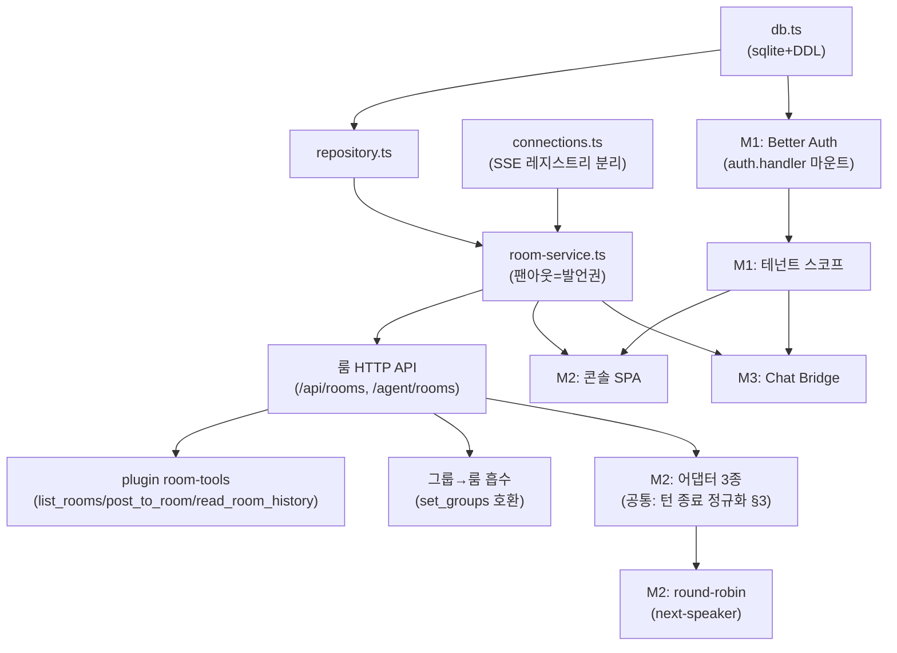

# 07. 핵심 테크 + 구현 순서

> 목적: 겉핥기 금지 — 검증된 기술 사실 위에서 구현 순서를 고정한다.
> 검증 수준 표기: **실행**(실제 설치·실행으로 확인) > **원문**(라이브러리 소스/공식 문서 원문) > **추정**(요약 기반 — 구현 시 재확인).
> 실행 플로우는 [08](08-flows-and-boundaries.md), API·엔티티는 [05](05-data-model-api.md) 기준.

## 1. 기술 선택 확정표

| 영역 | 선택 | 버전 정책 | 검증 | 핵심 근거 |
|------|------|----------|------|-----------|
| 런타임/서버 | Bun + `Bun.serve` | 현행 유지 | 실행(기존 broker) | 기존 자산. SSE 패턴 검증됨 |
| DB | `bun:sqlite` (WAL) | — | 실행 | Better Auth가 Database 인스턴스 직접 수용 |
| 시간순 ID | `Bun.randomUUIDv7()` (식별자) + **seq(sqlite rowid) 커서** | — | **실행** | 스모크 결과 동일 ms 단조성 위반 존재(100만 회 중 198회) → 정렬·after 커서·Last-Event-ID는 id가 아니라 **삽입 순서인 rowid(seq)** 사용으로 확정 |
| 인증 | `better-auth@1.6.23` + `@better-auth/api-key` | **정확 버전 고정** | **실행** | minor에서 breaking 전례. 1.4에서 api-key 별도 패키지화 |
| Claude 어댑터 | `@anthropic-ai/claude-agent-sdk` 0.3.x | 버전 고정 | 원문 | **V2 프리뷰(send/stream)는 0.3.142에서 제거됨** — `query()` + AsyncIterable 스트리밍 입력이 유일한 공식 경로 |
| OpenCode 어댑터 | `opencode serve` + `@opencode-ai/sdk` | 버전 고정 | 원문 | 진짜 상주 서버. `responseStyle: "data"` 고정 |
| Codex 어댑터 | `@openai/codex-sdk` | 버전 고정 | 원문(소스) | 프로세스 상주가 아니라 `thread.id` 영속의 논리적 상주 |
| Chat 연동 | Chat REST + Workspace Events + Pub/Sub pull | — | 추정(문서) | [04](04-google-chat-bridge.md). M3 착수 시 실검증 |

## 2. 검증에서 나온 설계 변경점 (문서 반영 완료)

1. **hd 검증은 Better Auth 네이티브** — `socialProviders.google.hd` 옵션이 인가 힌트 전송 + 서명된 id_token의 hd 클레임 강제(불일치 시 로그인 거부)를 라이브러리 레벨에서 수행. [01 §2](01-auth-tenant.md)에서 자작할 것은 "hd → organization 매핑 훅"뿐. **hd 저장 경로는 `databaseHooks.user.create.before` 단일 경로** — `input: false` 필드는 `mapProfileToUser` 반환값에서 조용히 스킵된다(v1.6.23 소스·실행 확인). 이 훅은 이메일/OAuth 가입 공통 경로라 두 방식 모두 커버. 클라이언트가 body에 hd를 실으면 400 `FIELD_NOT_ALLOWED`로 거부됨(주입 차단 확인).
2. **api-key mock 세션에는 activeOrganizationId가 없다(null)** — 에이전트 요청의 테넌트는 활성 조직이 아니라 **member 테이블 조회 또는 키 metadata(tenantId)**로 해석해야 한다. (실행 확인 — 05 인증 규칙에 반영)
3. **Agent SDK 첫 턴 MCP 경합(#368)은 여전히 미수정**(2026-07 기준 open) — 첫 메시지 push 전 `q.mcpServerStatus()` 폴링 게이트가 어댑터 구현 요건.
4. **Bearer 대신 `x-api-key` 헤더가 기본** — Better Auth api-key의 기본 헤더. **결정: 계약은 Bearer 유지(01/05), 구현은 `customAPIKeyGetter`로 Authorization 헤더에서 추출**(§7 코드).
5. **에이전트 토큰 검증은 `getSession` 한 줄로 통일** — `enableSessionForAPIKeys: true`(1.4부터 기본 off — 켜야 함) 설정 시 쿠키 세션과 api-key가 같은 `auth.api.getSession({headers})`로 해석된다. `verifyApiKey`와 중복 호출 금지(rate limit 2회 차감).

## 3. 턴 종료 판별 — 도구별 (어댑터 정규화의 핵심)

세 도구 모두 "프롬프트 주입 = 턴"이지만 **턴이 끝났음을 아는 방법**이 전부 다르다. 이것이 `NormalizedEvent.turn_completed`([03 §2.3](03-multi-agent.md))의 원천이다:

| 도구 | 턴 주입 | 턴 종료 신호 | 최종 텍스트 |
|------|---------|-------------|------------|
| Claude (Agent SDK) | inbox iterable에 `SDKUserMessage` push | generator에서 `{type:'result'}` 수신 (매 턴마다 나옴, 세션은 계속) | `result.subtype==='success'`일 때 `result.result` |
| OpenCode | `session.prompt()`(동기) 또는 `promptAsync` | 동기: await 반환 자체 / 비동기: 전역 이벤트 스트림의 `session.idle` (sessionID로 필터) | prompt 반환의 `parts` / message.part 이벤트 누적 |
| Codex | `thread.runStreamed(text)` | 이벤트 스트림의 `{type:'turn.completed'}` (`turn.failed`는 실패) | `item.completed` 중 `item.type==='agent_message'`의 `text` |

부속 확인 사항:
- Claude: `SDKUserMessage`는 `{type:'user', message:{role:'user', content}}` — session_id는 SDK가 채움. 세션 복구는 `options.resume: session_id`(system/init 이벤트에서 획득·저장).
- OpenCode: 이벤트 구독은 **전역 스트림 1개** — 어댑터는 연결 하나로 여러 세션을 `properties.sessionID`로 디멀티플렉스. 세션 생성 시 작업 디렉토리는 body가 아니라 **query 파라미터** `{query: {directory}}`.
- Codex: `env` 옵션을 지정하면 process.env를 **상속하지 않음**(PATH 누락 함정). 헬스체크 개념 없음 — `codex --version` 또는 startThread 성공으로 대체. 무인 구동 조합: `sandboxMode:"workspace-write"` + `approvalPolicy:"never"`.

## 4. 시스템 의존성 그래프 — 무엇이 무엇을 막는가



읽는 법: 화살표 앞이 없으면 뒤를 시작할 수 없다. **최장 경로는 db → repo → room-service → API → 어댑터 → round-robin** — 이것이 크리티컬 패스이므로 M0의 저장 계층을 가장 먼저, 가장 단단하게 만든다.

## 5. M0 구현 순서 — 커밋 단위 (각각 컴파일·테스트 통과)

레포 코드 분석 기반. 원칙: 기존 `broker-handlers` 분리 패턴 유지, 커밋당 1~3파일, 기존 사용자 무중단.

| # | 커밋 | 파일 | 검증 |
|---|------|------|------|
| 1 | bun:sqlite 도입 | `db.ts` (+test) — DDL·WAL. 아직 아무도 import 안 함. **DDL 결정: tenant_id/created_by는 nullable(M0 항상 NULL, M1에서 기본 테넌트 백필), agent PK는 `machine:alias` 전역 유일로 시작(테넌트 유니크는 M1 테이블 재작성 — SQLite UNIQUE가 NULL을 서로 다른 값으로 취급해 선반영 무의미), DB 경로 `CLAUDE_PEERS_DB`(기본 agora.sqlite), 테스트는 `openDb(":memory:")` 주입** | `bun test db.test.ts` |
| 2 | repository 모듈 | `repository.ts` (+test) — SQL은 전부 여기에만 | `bun test` |
| 3 | 연결 레지스트리 분리 | `connections.ts` 신설, `broker-handlers.ts`는 re-export(기존 테스트 무수정 통과), keepalive 이동 | `bun test` 전체 |
| 4 | register 영속화 + 머신 기본 룸 | `createHandlers(deps)` 시그니처 변경 — handlers·broker.ts·test 3파일 한 커밋(전부 같이 깨지므로). 기존 테스트의 `groups` 인메모리 단언은 repo 조회 단언으로 교체, 리셋은 테스트별 `:memory:` DB | 머신 open 룸 멤버 단언 |
| 5 | room-service | `room-service.ts` (+test) — postToRoom = insert 후 팬아웃(08 불변식 I1). **free 연속 발언 상한을 하드코딩 상수로 최소 구현**(08 §2.1의 규칙) | mock controller 팬아웃 단언 + 상한 거절 단언 |
| 6 | 룸 HTTP API | `broker.ts` routes 추가 + `shared/types.ts` 확장 | curl 스모크 (룸 생성→초대→발언→히스토리) |
| 7 | 그룹→룸 흡수 | set_groups → 동명 open 룸 매핑, send_message → `sharesRoom` 질의, 위장 응답 문자열 유지 | **기존 격리 테스트 전부 통과 = M0 회귀 게이트** |
| 8 | plugin room-tools | `plugin/server.ts` 도구 3종 + SSE 분기 + `bun run build` + **버전 5곳 bump(차기 minor)** | 실기동 2세션 룸 토론 (06 M0 시연) |
| 9 | (선택) Last-Event-ID 재생 | 08 플로우 C — M0에서 미루면 M2 자동 재연결과 함께 | 재생 단위 테스트 |

M0의 명시적 결정 5건:
- **M0는 기존 `/register` 경로·body를 유지**한다(`kind`는 기본값 `claude-code`로 기록). `/agent/*` 신설 경로와 `id` 자기신고 폐기는 M1의 Bearer 도입과 함께 — 그때까지 신규 룸 API도 `id`를 body/query로 받되 제거하기 쉽게 optional로 취급.
- **M0는 `mode=free`만 허용** — `round-robin` 생성 요청은 400 (moderator·next-speaker가 M2이므로 반쪽 동작 금지).
- **free 연속 발언 상한은 M0부터** (커밋 5, 규칙은 08 §2.1) — M0 시연이 곧 자유 토론이라 무한 핑퐁 방어를 미룰 수 없다.
- 1:1 메시지의 재생 범위: 저장 후 전달 실패 시 행이 남는데, 재생(커밋 9) 도입 시 "전송 실패였던 메시지"가 재전달된다 — 이것을 **의도된 복구로 정의**한다(수신자는 message id 중복 제거, 08 §3.1).
- Idempotency-Key의 저장은 **인메모리 TTL 맵**(휘발 허용 — 재시작 직후의 중복은 message id 중복 제거가 이중 방어), 도입 시점은 어댑터 자동 재시도가 생기는 M2.

## 6. 하위 호환 핵심 코드 (커밋 7의 정신)

```ts
// set_groups는 "동명 open 룸 멤버십 교체"로 흡수 — 응답 형태 불변
function handleSetGroups(req: SetGroupsRequest) {
  const names = [...new Set(req.groups.map(normalize).filter(Boolean))];
  if (names.length === 0) return { ok: false, error: "groups must not be empty" };
  const targetIds = names.map((n) => roomService.ensureOpenRoom(n).id);
  repo.replaceOpenRoomMemberships(agentId, targetIds); // open 룸만 교체 — 초대받은 normal 룸은 불변
  return { ok: true, groups: names };
}

// send_message의 그룹 교집합 → "같은 룸 공유" (open/normal 불문)
// SELECT EXISTS(... room_member a JOIN room_member b ON a.room_id=b.room_id
//   JOIN room r ON r.id=a.room_id AND r.status='active'
//   WHERE a.agent_id=?1 AND b.agent_id=?2)
```

`list_peers`의 `matched_groups`에는 공유 룸 이름을 채운다 — open 룸 이름 = 기존 그룹명이므로 구버전 사용자는 차이를 느끼지 못한다. 구버전 plugin의 SSE 루프는 `type==="message"`만 처리하고 나머지를 무시하므로 신규 이벤트가 흘러가도 안전(코드 확인됨).

## 7. 인증 마운트 핵심 코드 (M1 — 실행 검증됨)

```ts
// auth.ts — 접점은 이 모듈 1곳으로 격리
export const auth = betterAuth({
  database: new Database("agora.sqlite"),          // bun:sqlite 직접 수용 (실행 확인)
  socialProviders: { google: {
    clientId, clientSecret,
    hd: "*",                                        // 아무 Workspace나 허용 + hd 클레임 강제 (네이티브)
  }},
  user: { additionalFields: {                       // user 테이블에 hd 컬럼 (실행 확인)
    hd: { type: "string", required: false, input: false },  // input:false = 클라이언트 주입 시 400 거부
  }},
  databaseHooks: { user: { create: { before: async (user, ctx) => ({
    data: { ...user, hd: /* ctx의 검증된 id_token hd 클레임 */ null },
    // 주의: mapProfileToUser로는 불가 — input:false 필드는 프로필 유래 값이 스킵됨 (§2)
  })}}}},
  plugins: [organization({ organizationHooks: {...} }),
            apiKey({ defaultPrefix: "agora_", enableSessionForAPIKeys: true,
                     // 계약은 Authorization: Bearer (01/05) — 기본 x-api-key 대신 커스텀 추출
                     customAPIKeyGetter: (ctx) =>
                       ctx.request.headers.get("authorization")?.replace("Bearer ", "") ?? null })],
});

// broker.ts — 마운트는 한 줄, 가드는 한 함수
if (url.pathname.startsWith("/api/auth")) return auth.handler(req);
const session = await auth.api.getSession({ headers: req.headers }); // 쿠키·api-key 공용
```

- 스키마는 `bunx --bun @better-auth/cli@latest migrate` — 테이블 8개(user/session/account/verification/organization/member/invitation/apikey) + additionalFields 컬럼 생성. Agora 도메인 테이블(§5 커밋 1)과 같은 sqlite 파일 공존. **CLI 버전 함정**: `@better-auth/cli`는 본체와 버전이 따로 간다(@1.6.23 태그 없음, latest=1.4.21) — `@latest`로 호출하되 본체는 1.6.23 고정.
- 도메인→조직 조회는 세션 없이 `auth.api.listOrganizations` 불가(Unauthorized) — **sqlite 직접 쿼리**(`SELECT id FROM organization WHERE slug=?`)로 한다(실행 확인).
- 부트스트랩·합류는 서버 전용 API로 세션 없이 가능: `auth.api.createOrganization({body:{..., userId}})`(첫 사용자가 owner), `auth.api.addMember(...)`.

## 8. 남은 검증 항목 (구현 착수 시 스모크로 해소)

해소됨 (2026-07-15 로컬 스모크):
- ~~`Bun.randomUUIDv7()` 단조성~~ → **위반 존재 확인**(100만 회 중 198회, Bun 1.3.11). 결정: message.id는 uuidv7(전역 식별자), 정렬·커서·SSE `id:`·Last-Event-ID는 **seq(rowid)**. 05·08 반영 완료.
- ~~Bun.serve `routes` 우선순위~~ → **검증 통과**(Bun 1.3.11): routes가 경로 파라미터 포함 우선 매칭, 미스는 fetch 폴백. 커밋 6 방식 확정.
- ~~`user.additionalFields`로 hd 저장~~ → **실행 검증 통과**: migrate가 hd 컬럼 생성, `user.create.before` 훅으로 설정, `getSession().user.hd`로 조회. 단 mapProfileToUser 경로는 불가(§2) — 훅 단일 경로 확정.

| 항목 | 확인 방법 | 걸린 결정 |
|------|----------|----------|
| SDK MCP(in-process) 서버가 #368 영향권인지 | 첫 턴 도구 목록 로깅 | 게이트 필요 범위 |
| OpenCode `POST /mcp` body 세부 | `GET /doc` OpenAPI 대조 | room-tools 동적 주입 (폴백: opencode.jsonc) |
| Codex SDK `config` 옵션의 mcp_servers 평탄화 | 실행 스모크 | config.toml 없이 주입 가능 여부 |
