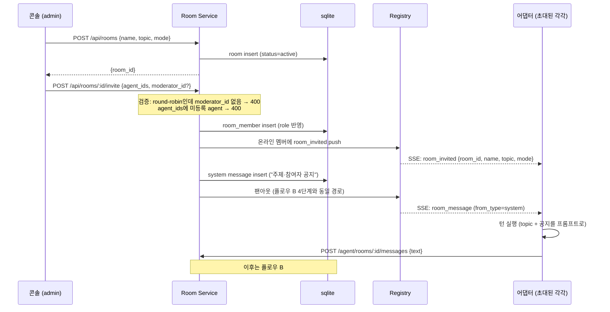
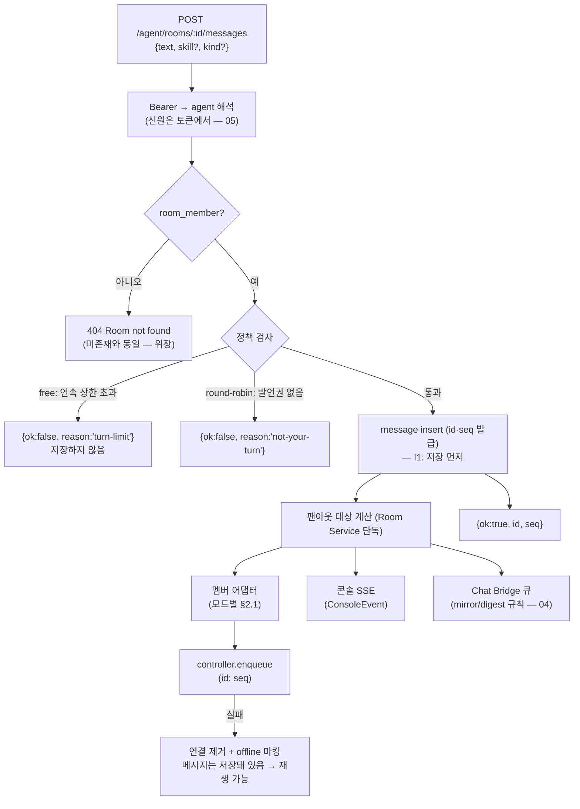
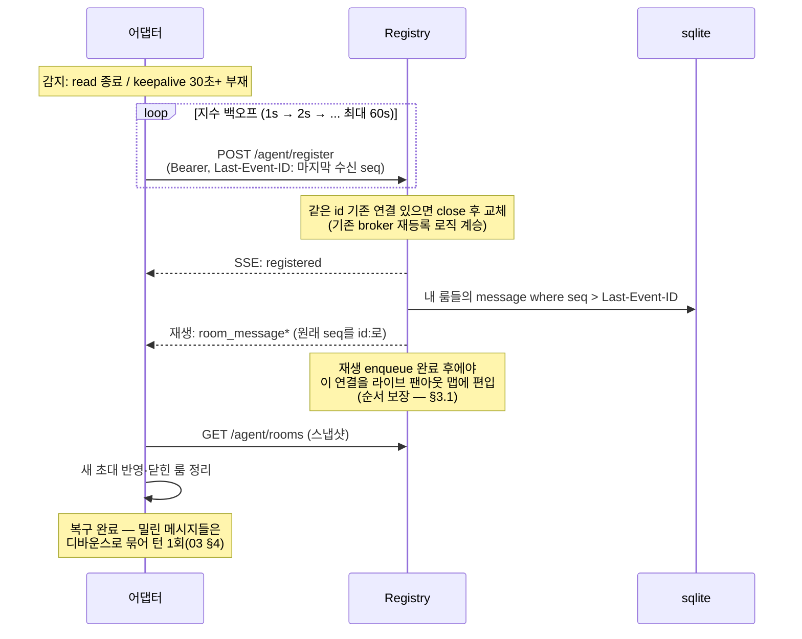
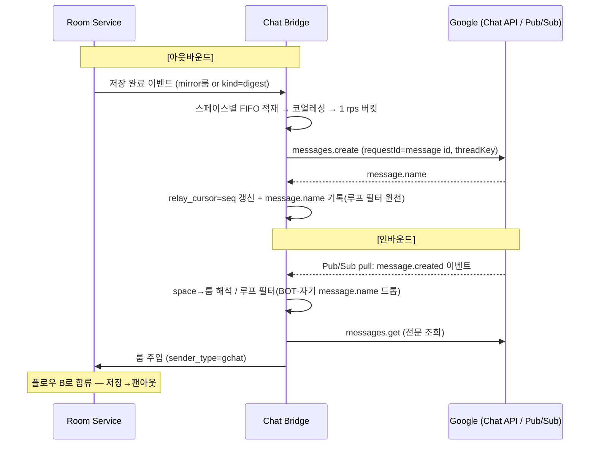
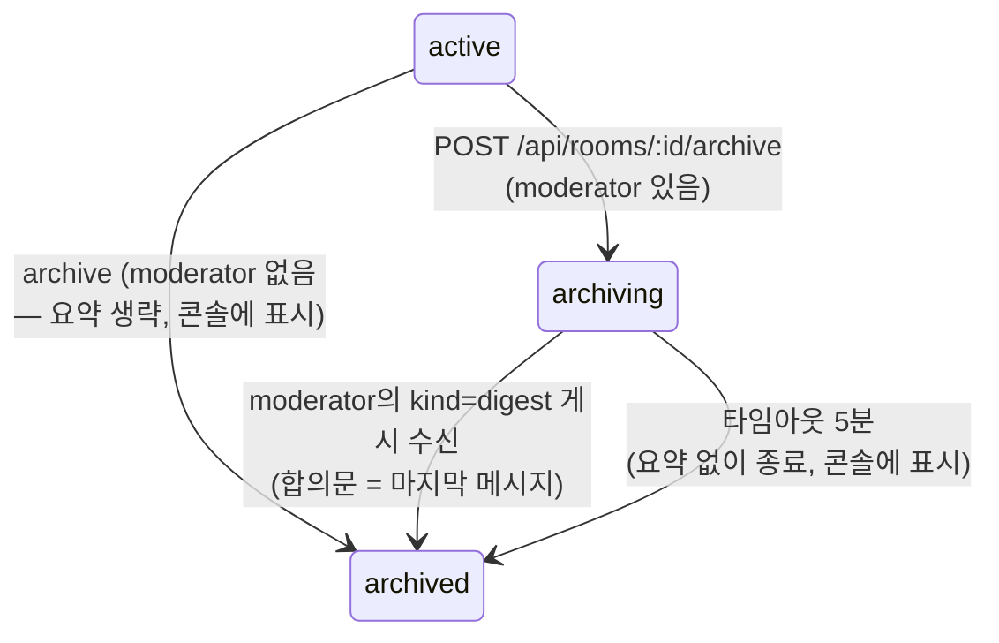

# 08. 실행 플로우 + 경계

> 목적: 아이디어가 실제로 "돌아가는" 순간의 단계·데이터·상태를 구현 가능한 수준으로 고정한다.
> API·엔티티는 [05](05-data-model-api.md), 구현 순서는 [07](07-tech-and-order.md) 기준.
> 이 문서는 M0 범위의 핵심 플로우 3개부터 시작한다. (Chat 왕복·인증 이행 플로우는 이후 사이클에서 추가)

## 0. 컴포넌트 책임 경계

플로우를 읽기 전에, "누가 무엇을 결정하는가"를 고정한다. 경계를 넘는 결정은 금지.

| 컴포넌트 | 결정하는 것 | 결정하지 않는 것 |
|----------|------------|-----------------|
| Room Service (Hub) | 발언권(팬아웃 대상), 룸 정책(상한·모드), 메시지 순서(seq), 멤버십 | 발언 내용, 요약 생성 |
| Agent Registry (Hub) | 연결 상태(online/offline), 이벤트 전달, 재생 | 턴 실행 여부 |
| 어댑터 | 턴 실행 방법(도구 네이티브), 재연결, catch-up | 발언권(수신 = 발언권 — 판단하지 않음), 정책 |
| 에이전트(모델) | 발언 내용, next-speaker 지정(moderator), 요약 | 팬아웃, 저장 |
| 콘솔 | 사람의 의도 입력(생성·초대·개입·제어) | 정책 집행(집행은 Hub) |

핵심 불변식 2개:

- **I1. 저장이 전달보다 먼저다.** message insert(id·seq 발급) 성공 후에만 팬아웃한다. 전달은 실패해도 재생으로 복구 가능하지만, 저장 실패는 복구 불가이므로 이 순서는 뒤집을 수 없다.
- **I2. 팬아웃 = 발언권.** 어댑터는 `room_message`를 받으면 턴을 돌린다는 단순 규칙만 가진다([03 §4](03-multi-agent.md)). 따라서 "누구에게 push하는가"가 곧 토론 제어이고, 이 계산은 Room Service 단 한 곳에서만 한다.

## 1. 플로우 A — 룸 생성 → 초대 → 첫 턴

**경계**: 콘솔의 `POST /api/rooms` 호출에서 시작해, 첫 에이전트 발언이 message 테이블에 저장되는 순간 끝난다. 이후는 플로우 B의 반복.



단계별 상태 변화:

| 단계 | 데이터 변화 | 실패 시 |
|------|------------|---------|
| 룸 생성 | room row (status=active) | 400/500 — 아무것도 안 만들어짐 (단일 insert) |
| 초대 | room_member rows | 검증 실패 시 멤버 0명 — 전부 성공 또는 전부 실패(트랜잭션) |
| room_invited push | 없음 (알림만) | **오프라인 멤버는 못 받아도 정상** — room_member가 진실이고, 재연결 시 `GET /agent/rooms` 스냅샷으로 복구(플로우 C) |
| 공지 게시 | system message row | I1 위반 불가 — insert 실패면 팬아웃 없음 |
| 첫 턴 | (어댑터 내부) | 턴 실패 시 어댑터가 `turn_failed`를 콘솔 관측 이벤트로만 보고(`POST /agent/observations` — 05), 룸에는 침묵 — 토론은 다른 멤버로 계속 |

경계 규칙:

- `room_invited`는 **편의 알림**이지 멤버십의 원천이 아니다. 원천은 room_member 테이블. 어댑터는 이벤트를 놓쳐도 스냅샷 재동기화로 같은 상태에 도달해야 한다(멱등).
- free 모드의 첫 턴은 **전원에게 동시에** 발생한다 — 첫 공지 팬아웃을 받은 모두가 턴을 돌린다. 이것이 의도된 동작(자유 토론의 개시)이며, 이후 연속 발언 상한이 폭주를 막는다. round-robin은 공지를 moderator에게만 push해 사회자가 첫 발언자를 지정하게 한다.

## 2. 플로우 B — 메시지 팬아웃 (토론의 심장)

**경계**: `POST /agent/rooms/:id/messages` 수신에서 시작해, 모든 구독자(멤버 어댑터·콘솔 SSE·Chat Bridge 큐)의 enqueue가 끝나면 끝난다. **수신자의 턴 실행은 이 플로우 밖이다** — 그건 다음 플로우 B를 촉발하는 별개 사건.

인증 표기 주석: 이 도식(과 플로우 C)의 "Bearer"는 M1 최종형이다 — M0 무인증 과도기에는 `id?` 자기신고로 대체된다([05 Agent API 과도기 결정](05-data-model-api.md)).



### 2.1 팬아웃 대상 계산 (모드별)

| 모드 | 발신자 | 수신자 |
|------|--------|--------|
| free | 아무 멤버 | 모든 온라인 멤버 − 발신자 자신 (+콘솔, +Bridge) |
| round-robin | 지정 발언자 또는 moderator 또는 사람 | moderator(항상) + 지정된 다음 발언자(있으면) − 발신자 자신 |
| (공통) 사람/system/gchat 발신 | — | free: 전원 / round-robin: moderator만 (사회자가 배분) |

연속 발언 상한의 정의 (M0부터 하드코딩 상수 — [07 §5 커밋 5](07-tech-and-order.md)):
- "연속" = 같은 발신자가 **다른 발언자(사람 포함)의 개입 없이** 연이어 게시한 수. 다른 발신자(agent/user/gchat)가 게시하면 카운터 리셋(리셋은 팬아웃 계산 **전에** 적용).
- **system 발신은 상한 계산·카운터 리셋 어느 쪽에도 관여하지 않는다** — 경고·공지 메시지가 상한을 무력화하는 순환(도달 → 경고 게시 → 리셋 → 재발언)을 차단.
- 거절이 반복되면(제안: 연속 5회) 콘솔 알림 + 사회자 system 통지, 사회자 없으면 `status=paused` ([02](02-admin-console.md)).
- 제안 상한: 연속 3회. 도달 시 **게시 거절(`turn-limit`)이 유일한 방어** — 팬아웃 제외는 두지 않는다.
  (다른 발신자의 게시가 어차피 카운터를 리셋하므로 "도달자 제외"는 항상 공집합인 죽은 규칙이고,
  도달자도 다음 발언을 계속 수신해야 리셋 후 자연스럽게 복귀한다.) 사람 발언은 상한 계산 제외([03 §4](03-multi-agent.md)).

### 2.2 경계 실패 처리

| 실패 | 지점 | 처리 |
|------|------|------|
| 정책 거절 | 저장 전 | 저장 안 함. 어댑터는 결과 폐기 후 관전([03 §4](03-multi-agent.md)). 거절은 콘솔 이벤트로 관측 가능 |
| enqueue 실패 | 저장 후 | 해당 연결만 제거(기존 broker `send-failed` 패턴 계승). 메시지는 이미 저장 → 그 에이전트는 재연결 재생으로 수신 |
| 게시 재시도 중복 | 어댑터 재시도 | 어댑터가 `Idempotency-Key` 헤더(턴 단위 uuid)를 보내고 Hub가 최근 키를 기억해 중복 insert 방지 — 05 반영 완료 |
| skill 미지원 수신자 | 어댑터 | Claude Code만 네이티브, 나머지는 프롬프트 번역(03). Hub는 관여하지 않음 |

## 3. 플로우 C — SSE 재연결·복구

**경계**: 어댑터가 연결 사망을 감지한 순간 시작, "재생 완료 + 스냅샷 재동기화 완료"로 끝난다. 끝난 시점에 어댑터는 끊기지 않았던 것과 동일한 상태여야 한다(놓친 command 제외 — 만료 간주, 05).



### 3.1 재생-라이브 순서 경계 (경합 지점)

재생 중에 새 메시지가 게시되면 순서가 꼬일 수 있다. 규칙:

1. register 처리 시 **재생 대상 조회와 라이브 맵 편입을 같은 임계 구역**에서 처리한다(단일 프로세스 + 동기 sqlite 조회라 Bun에서는 자연스럽게 원자적 — await 지점을 두지 않는 것이 구현 요건).
2. 그래도 클라이언트는 순서를 신뢰하지 말고 **수신 message id 집합으로 중복 제거**한다(재등록 직전 enqueue된 이벤트가 신·구 연결 양쪽에 들어올 수 있음). id 문자열(uuidv7)은 동일 ms에서 순서 보장이 없음이 스모크로 확인됨([07 §1](07-tech-and-order.md)) — 순서의 원천은 seq뿐이다.
3. 1:1 메시지(room_id null)도 같은 재생 경로를 탄다 — 조회 조건이 "내 룸들의 메시지 + 나를 수신자로 하는 1:1"로 확장될 뿐.

### 3.2 감지 시간의 경계

| 감지자 | 수단 | 최대 지연 |
|--------|------|-----------|
| Hub → 어댑터 사망 | keepalive enqueue 실패 (기존 30초 주기) | ~30초. 그동안 팬아웃은 enqueue 실패로 즉시 감지될 수도 있음 |
| 어댑터 → Hub 사망 | read 스트림 종료 or keepalive 45초 부재(30초 주기 + 여유) | ~45초 |
| 콘솔 표시 | last_seen_at + ping 커맨드(02) | 표시상 offline이어도 room_member는 유지 — 상태와 멤버십은 별개 |

- 어댑터가 죽었다 살아나도 room_member가 유지되므로 토론에 자동 복귀한다. **명시적으로 빼려면** 콘솔에서 퇴장(DELETE members) — 상태(연결)와 자격(멤버십)의 경계.

## 4. 플로우 D — Chat 왕복 (M3)

**경계**: 바인딩 완료(chat_link 존재 + 구독 active)를 전제로 시작한다. 바인딩 자체는 [04 §3](04-google-chat-bridge.md).
아웃바운드는 "message 저장 → Chat에 표시", 인바운드는 "Chat 발언 → 룸 팬아웃(플로우 B 합류)"으로 끝난다.



경계 실패 처리:

| 실패 | 처리 |
|------|------|
| 429 / 일시 오류 | 지수 백오프하되 큐 선두 유지 — 스페이스 내 순서 역전 금지 (04 §4.1) |
| Bridge 프로세스 재시작 | `chat_link.relay_cursor`(마지막 릴레이 성공 seq)부터 message 테이블 재생 — 큐는 인메모리여도 유실 없음 |
| 구독 만료 | 갱신 워커 + lifecycle 이벤트 2중화, 구간 유실은 `spaceEvents.list` 백필 (04 §6) |
| 루프(되울림) | 아웃바운드가 기록한 message.name 집합 + sender.type=BOT 필터 — **두 필터 모두** 통과해야 주입 |

상태의 위치: 코얼레싱 윈도·버킷은 인메모리(휘발 허용 — 재시작 시 cursor 재생으로 복원), `relay_cursor`·`expire_time`은 chat_link(영속). **relay_cursor는 05 chat_link에 반영 완료.**

## 5. 플로우 E — 인증 이행 (M1 전환 운영)

**경계**: 무인증 브로커가 돌아가는 상태에서 시작, `required` 전환 후 무토큰 세션이 0이 되면 끝난다.
01 §5의 단계를 운영 절차로 구체화 — **플래그를 3값으로 확장한다: `off | soft | required`** (01 반영 완료).

| 단계 | 플래그 | 동작 | 관측 |
|------|--------|------|------|
| 1. M1 배포 | `off` | auth.handler 마운트, 콘솔 로그인·토큰 발급 가능. `/agent/*` 무검증 | — |
| 2. 플러그인 배포 | `off` | plugin 차기 minor (`CLAUDE_PEERS_TOKEN` 지원) 마켓플레이스 배포 | 사용자 업데이트 대기 |
| 3. 관측 모드 | `soft` | 토큰 있으면 해석해 신원 기록, **없어도 허용**하되 로그 | 무토큰 register 비율이 0에 수렴하는지 대시보드 |
| 4. 강제 전환 | `required` | 신규 register부터 무토큰 거부(401). **기존 연결은 즉시 끊지 않음** | 무토큰 잔존 연결 수 |
| 5. 정리 | `required` | 전환 후 유예(제안 24시간) 지나면 잔존 무토큰 SSE에 시스템 메시지 통지 후 close | 0 확인 |

경계 규칙: 전환의 원자 단위는 "register 시점"이다 — 살아있는 연결을 즉시 자르면 무중단 원칙 위반이고, 영원히 두면 인증이 무의미하다. "신규만 거부 + 24h 유예 후 종료"가 그 절충. 롤백은 플래그를 `soft`로 되돌리는 것뿐(스키마 롤백 없음 — 인증 데이터는 남아도 무해).

## 6. 플로우 F — 어댑터 유휴 하이버네이트·재기동 (M2)

**경계**: 어댑터 데몬은 계속 살아있다(SSE 유지 — online 상태 보존). 잠드는 것은 **도구 세션뿐**이다.
Codex는 원래 논리적 상주(run 사이 프로세스 없음 — [03 §3.3](03-multi-agent.md)), OpenCode는 세션이 저렴 — **이 플로우는 사실상 Claude 어댑터 전용**이다.

```
[상주]  room_message 없이 idle T(제안 15분) 경과
   → q.close() + session_id 영속 저장 → 도구 프로세스/세션 해제        [동면]
[동면]  room_message 도착
   → query({resume: session_id}) 재기동 → #368 게이트(mcpServerStatus 폴링)
   → 밀린 메시지 디바운스로 묶어 턴 1회                                  [상주]
[동면]  resume 실패 (세션 파일 유실 등)
   → 새 세션 생성 + read_room_history로 룸 맥락 재구축 (룸이 기억을 보완) [상주]
```

경계 규칙:
- Hub는 동면을 모른다 — 어댑터 내부 상태다. Hub 관점에서 online/offline은 SSE 연결뿐(책임 경계 §0).
- 동면 중 `command: ping`은 데몬이 즉시 응답(도구 재기동 불필요). `instruct`는 재기동 트리거.
- resume 실패 폴백이 성립하려면 **룸 히스토리가 곧 에이전트의 외부 기억**이어야 한다 — 어댑터는 자기 상태를 도구 세션에만 두지 말 것(설계 지침).

## 7. 플로우 G — 룸 아카이브 (M2)

**경계**: 콘솔의 archive 요청에서 시작, `room_closed` 팬아웃 + Bridge 마지막 릴레이로 끝난다.
room.status에 중간 상태 **`archiving`을 추가**한다 (05 반영 완료).



순서(모더레이터 경로): ① status=archiving — 이 순간부터 **일반 게시는 `{ok:false, reason:'archiving'}`으로 거부**하되 moderator의 digest만 허용(마지막 발언 경합 차단) ② moderator에 `instruct(skill=summarize)` push ③ digest 게시 수신(kind 표기 규칙은 [03 §2.4](03-multi-agent.md)) → 저장 → status=archived ④ `room_closed` 팬아웃(어댑터는 룸 정리) ⑤ Bridge가 digest를 마지막으로 릴레이 후 구독 해지.

경계 실패: moderator가 5분 내 게시하지 못하면 요약 없이 archived(타임아웃은 command id로 추적 — 05의 command 응답 경로). archived 룸에의 게시는 명시적 거부(`archived`) — 멤버에게 룸은 보이므로 `Room not found` 위장을 쓰지 않는다(위장은 비멤버 전용, 05 격리 규칙).

## 8. 부속 플로우 3건 (경계 결정만 — 상세는 구현 시)

### 8.1 콘솔 SSE(`/api/events`) 재연결

**결정: 에이전트 SSE와 다르게, 재생하지 않는다.** 콘솔은 관전자다 — 놓친 이벤트의 진실은 REST 스냅샷에 있다.
재연결 시 EventSource가 자동 재접속(브라우저 내장, 쿠키 인증) → 화면이 `GET /api/agents`·`GET /api/rooms/:id/messages?after=`로 스냅샷을 다시 당겨온다([02 §2](02-admin-console.md)의 "SSE 단일 스트림 + 진입 시 REST 스냅샷" 패턴이 재연결에도 그대로 적용).
Last-Event-ID 재생 로직을 콘솔용으로 복제하지 않는 것이 단순성의 핵심 — 재생은 "놓치면 상태가 틀어지는 쪽"(에이전트)에만 필요하다.

### 8.2 테넌트 온보딩 (운영 절차 — M1/M3)

경계: 사람 절차(Google 콘솔·Workspace 관리자)와 시스템 절차의 분리. 시스템이 자동화할 수 없는 단계는 콘솔 안내 화면으로 제공한다.

1. (M1, 시스템) 첫 관리자가 Google 로그인 → hd 화이트리스트 통과 → 테넌트 부트스트랩([01 §2](01-auth-tenant.md))
2. (M1, 사람) 콘솔에서 에이전트 토큰 발급 → 머신에 배포
3. (M3, 사람) Workspace 관리자: Chat 앱 설치 + `chat.app.*` 스코프 승인 ([04 §8](04-google-chat-bridge.md) 온보딩 마찰 — 콘솔에 승인 요청 가이드 표시)
4. (M3, 시스템) 첫 chat-link 생성 시 Pub/Sub 토픽 프로비저닝 검사 — 실패하면 안내와 함께 거부 (조용한 반쪽 연동 금지)

### 8.3 에이전트 제거·토큰 폐기

| 사건 | 즉시 효과 | 룸 처리 |
|------|----------|---------|
| 토큰 폐기 (`DELETE /api/tokens/:id`) | 그 토큰의 신규 요청 401. **기존 SSE는 다음 요청/keepalive 검증 실패 시 종료** | room_member 유지 — 재발급 토큰으로 복귀 가능 (연결과 자격의 분리, §3.2) |
| 에이전트 제거 (콘솔) | 연결 종료 + agent row 보존(last_seen 동결 — message.sender_id가 참조하므로 삭제 금지) | 모든 room_member에서 제거 + 각 룸에 system 메시지("퇴장") |
| 룸에서만 퇴장 (`DELETE /api/rooms/:id/members/:agentId`) | 해당 룸 팬아웃에서 제외, `room_closed`가 아닌 개별 통지 | 다른 룸 멤버십·연결 유지 |

경계 규칙: **agent row는 소프트 삭제만** — message의 발신자 표시가 영구히 깨지지 않아야 한다(감사 로그 불변).
