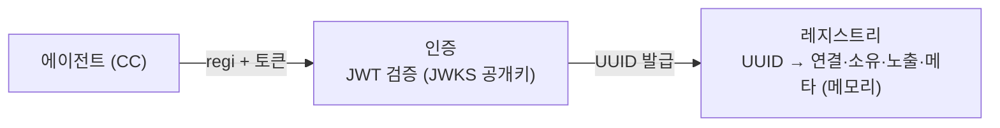
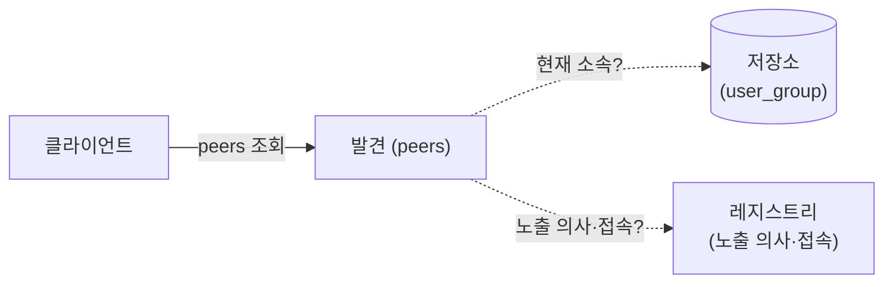
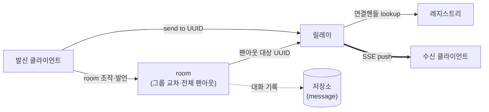

# 아키텍처

> 시스템의 현재 구조와 확정 결정. 용어·엔티티는 [01-domain-model](01-domain-model.md), 검증된 기술 사실은 [02-tech-notes](02-tech-notes.md).

## 1. 실행 형태

단일 Bun 프로세스 — 브로커·인증·웹 API·정적 UI를 하나의 `Bun.serve`에 경로 prefix로 구획한다(`/api/auth/*` 마운트 + routes/fetch 폴백). 웹 API가 레지스트리를 직접 읽고 웹 세션을 등재해야 하므로 프로세스 분리는 프로토콜 비용만 낳는다. 레지스트리가 힙에 있으므로([01 §3.1](01-domain-model.md)) 브로커는 단일 노드다 — 확장 대비는 프로세스가 아니라 모듈 경계로 한다.

## 2. 모듈

| 모듈 | 책임 | 코드 |
|------|------|------|
| 브로커 | 레지스트리(엔트리·연결 위생), 릴레이(send·성패 응답), regi(SSE), 발견 판정(교집합), room 팬아웃 | `src/broker/` |
| 인증 | Better Auth 접점 격리 모듈 — 로그인·초대 게이트·토큰(JWT) 발급·검증 | `src/auth/` |
| 웹 API | 사용자·관리자 HTTP API. 관리자는 별도 모듈이 아니라 권한 구분([01 §2](01-domain-model.md)) | `src/api/` |
| 웹 UI | React SPA — 화면은 §5 | `web/` |
| 저장소 | user·group·user_group·room·room_participant·message. SQL은 이 모듈 안에만 — 저장소 전환 비용을 모듈 하나로 국한 | `src/store/` |
| 플러그인 | CC 세션당 MCP 채널 서버([plugin](plugin.md)) | `plugin/` |

## 3. 동작 흐름

### ① 등록

토큰(JWT)으로 인증하면 브로커가 agent UUID를 발급하고 `{연결핸들, 소유자, 노출 그룹, 메타}` 엔트리를 레지스트리(메모리)에 등재한다([01 §3.1](01-domain-model.md)). 검증은 같은 프로세스의 JWKS 공개키로만 하며 DB 조회가 없다([02 §2](02-tech-notes.md)).

### ② 발견

같은 그룹에 노출된, 접속 중인 에이전트만 보인다. 판정은 조회 시점의 `노출 의사 ∩ 현재 소속` 교집합([01 §3.2](01-domain-model.md)). 그룹은 **발견만** 격리한다.

### ③ 대화 / room

1:1이든 room 팬아웃이든, 릴레이가 대상 UUID로 연결핸들을 찾아 SSE push하고 발신자에게 성패를 응답한다(성공 `{ok:true}`, 실패 `{ok:false}`). UUID만 있으면 그룹과 무관하게 전달된다 — 그래서 room이 그룹을 가로지를 수 있다. **room 발언은 message로 기록**되어 나중에 조회할 수 있다(1:1은 기록하지 않음).

## 4. 확정 결정

- **저장소 = bun:sqlite** — 단일 파일(기본 `./data/broker.db`, `BROKER_DB_PATH`로 변경), WAL 모드. Better Auth 테이블은 CLI migrate(`bun run auth:migrate`), 도메인 테이블은 번호 붙인 SQL 마이그레이션(`db/migrations/`)을 부팅 시 적용(schema_migrations 이력 테이블로 추적). ORM 없음. 정렬·커서는 rowid([02 §3](02-tech-notes.md)).
- **테스트 = bun test 3층** — ① 동작 테스트(주력): 임시 포트로 실서버를 띄워 실제 HTTP/SSE로 검증, DB는 테스트마다 `:memory:`/임시 파일 ② 순수 로직 단위 테스트(교집합 판정·이벤트 파싱 등) ③ 수동 스모크: 실물 CC 연결·Google OAuth 실물 플로우(자동화 제외 — 절차는 [smoke-guide](smoke-guide.md)). JWT 서명·검증은 테스트 키로 실제 수행한다. keepalive·room 타이머 등 시간 요소는 설정 주입으로 결정론을 확보한다.
- **연결 위생** — keepalive 주석 프레임 30초(push 실패 = 엔트리 제거) / 유휴 타임아웃 없음(half-open 좀비는 재시작까지 잔존 — 수용된 트레이드오프) / 프로세스당 연결 수 상한 1,000(초과 register는 503, 리쥼 교체는 통과) / **미전송 큐 상한 없음** — Bun이 소켓 backpressure를 유저스페이스에 전파하지 않아 밀린 양을 측정할 수 없고([02 §3](02-tech-notes.md)), 동기 버스트만 잡는 반쪽 방어는 두지 않는다. 값은 env(`BROKER_HEARTBEAT_INTERVAL_MS`·`BROKER_MAX_CONNECTIONS`)로 외부 주입, 코드에는 기본값만.
- **스케줄 = 하트비트 1개로 동결** — 앱 전체에 인터벌은 하나(기본 30초)만 두고, 순찰 작업(keepalive·room 만료 스위프·이후 추가분)을 목록으로 등록해 돌린다. 인터벌 증식이 유지보수 부패의 원인이라는 운영 경험에 따른 구조적 봉인. 작업 하나의 예외가 다른 작업을 막지 않는다.
- **room 종료 처리** — 만료의 정확한 강제는 발언 시점 `ends_at` 검사(room-send에서 거부), 스위프는 상태 전환·room-end 통보만 담당(하트비트 위 작업 — 통보가 주기만큼 늦는 것은 수용). 버튼 폭파와 스위프 만료는 같은 폭파 함수를 탄다.
- **웹 UI = React + TypeScript, Bun 내장 번들링(HTML import)** — 실시간(SSE 반영) 화면이라 SPA, Better Auth react 클라이언트 사용. 분리 대비 습관: `web/`은 서버에서 공유 타입만 import, API는 상대경로 + base 상수 1곳. 폴백은 `bun build` 정적 산출물.
- **도구 체인** — Bun 1.3.11 고정(`engines.bun` 단일 소스 + 테스트 프리로드에서 버전 가드. bun은 engines를 강제하지 않는다). 린트·포맷은 Biome(2 spaces·120). 타입 게이트는 `tsc --noEmit`. JWT는 jose — 브로커 검증은 공개키 주입 구조, 키 출처는 같은 프로세스의 Better Auth JWKS(부팅 시 1회 로드 — 키 회전은 재기동 전제). 의존성은 정확 버전 고정([02 §2](02-tech-notes.md) 교훈).
- **관리자 부트스트랩 = 스크립트** — 첫 admin은 화면이 아니라 `bun scripts/bootstrap-admin.ts <email>`로 만든다(멱등).
- **인증 범위** — 토큰 검증은 regi에서만 한다. 브로커의 나머지 API(`/send`·`/room-send`·`/peers` 등)는 무인증 — from 위조 가능을 수용한 상태다.

## 5. 웹 화면

웹은 user 세션으로 동작한다. 관리자도 user이며 관리 화면만 추가로 가진다([01 §2](01-domain-model.md)).

| 화면 | 대상 | 다루는 것 | 코드 |
|------|------|----------|------|
| 로그인 | 모두 | Google 로그인 — 초대된 계정만 통과 | `web/app.tsx` |
| 내 에이전트 | 사용자 | 자기 토큰 생성, 접속 중인 자기 에이전트 목록 | `web/my-agent.tsx` |
| 에이전트 목록 | 사용자 | 노출 교집합 기준 접속 중 에이전트 모니터, 1:1 대화 진입점 | `web/agents.tsx` |
| 1:1 대화 | 사용자 | 특정 에이전트(UUID)와 주고받기 — 웹 세션은 노출 없는 등재, 기록 없음 | `web/chat.tsx` |
| room | 사용자 | 생성·참여자 배치(페르소나)·시작·종료, 관전·참여, 종료된 room 기록 조회 | `web/rooms.tsx`·`web/room-panel.tsx` |
| 사용자·그룹 관리 | 관리자 | 사용자 생성·삭제·초대 안내 복사, 그룹 생성·삭제, user_group 부여·회수 | `web/admin.tsx` |

## 6. 범위 밖

- 멀티플랫폼 에이전트(OpenCode·Codex) 어댑터 — 구동 조사 사실은 [02 §1](02-tech-notes.md).
- 메신저 연동(Google Chat 등) — 조사 사실은 [02 §4](02-tech-notes.md).
