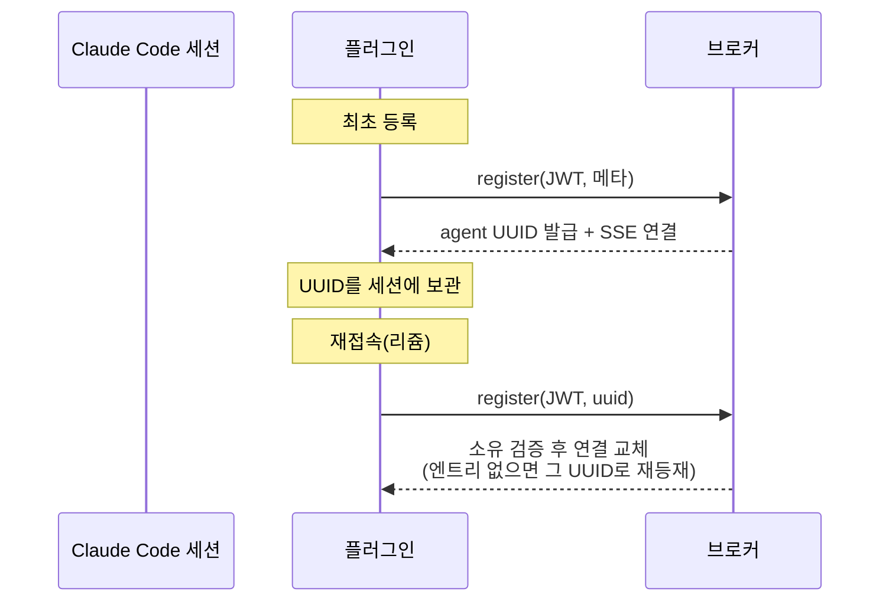

# CC 플러그인

> 에이전트(Claude Code)가 브로커에 붙는 클라이언트. 용어·엔티티는 [01-domain-model](01-domain-model.md), 코드는 `plugin/`.

## 1. 구조

- **채널 서버** — 세션당 stdio로 뜨는 MCP 서버(`claude/channel` capability). CC가 플러그인을 로드하며 spawn한다.
- **아웃바운드** — Claude가 도구(§2)를 호출해 브로커 HTTP API로 요청한다.
- **인바운드** — `POST /register` 응답 SSE 스트림을 읽어 `notifications/claude/channel`로 주입한다. `from_id`·`room_id`·`sent_at`·`skill`이 `<channel>` 태그 속성이 된다. 끊기면 사용자에게 알리기만 한다 — 재등록 여부·시점은 클라이언트 자율이며 브로커는 관여하지 않는다.
- **채널 알림은 플러그인으로 설치된 서버에만 주입된다** — 같은 서버를 일반 `claude mcp add`로 붙이면 도구는 되지만 인바운드 알림이 주입되지 않는다(실측).
- **skill 지시** — 수신 메시지에 skill 속성이 있으면 그 스킬 실행을 지시받는다(프롬프트 수준 — 하드 보장 아님).

## 2. 도구 (7종)

| 도구 | 요지 |
|------|------|
| `register(alias?, status?)` | 등록 — 브로커가 UUID를 발급하고 SSE 연결. 재호출은 보관된 UUID로 리쥼(§3) |
| `send_message(to_id, message, skill?)` | 1:1 전달. 수신자가 미접속이면 `Peer not found` |
| `send_room(room_id, message)` | room 발언 — **기록되고 전원에게 팬아웃**([01 §5](01-domain-model.md)). 그 의미 차이 때문에 1:1과 도구를 분리했다 |
| `list_peers` | 같은 노출 그룹의 접속 에이전트 목록(uuid·alias·status) |
| `set_groups(groups)` | 노출 그룹을 명시 목록으로 고정. 전 그룹 추종으로 복귀는 재등록뿐 |
| `list_groups` | 소유자의 소속 전체 + 노출 설정 + 실제 노출 그룹 |
| `set_meta(alias?, status?)` | 표시 메타 갱신 — 생략한 필드는 유지 |

## 3. 정체성 흐름

- **UUID 보관은 플러그인 몫** — 브로커가 발급한 UUID를 세션 메모리에 들고 있다가, 재접속 시 register가 그 UUID로 리쥼한다. 엔트리가 살아있으면 토큰의 user가 소유자와 일치할 때만 교체되고, (브로커 재시작 등으로) 없으면 같은 UUID로 새로 등재된다([01 §3.1](01-domain-model.md)). 보관 없이 register하면 새 에이전트가 된다.
- **토큰(JWT)은 env로 주입** — `ROSTER_BROKER_URL`·`ROSTER_BROKER_TOKEN`(변수명의 단일 정의 지점은 `plugin/env.ts`). 토큰의 사용처가 regi뿐이라 기동 시점 1회 주입으로 충분하다.

## 4. 패키징

- 레포 루트 `.claude-plugin/marketplace.json`(마켓플레이스 매니페스트) + `plugin/.claude-plugin/plugin.json`(플러그인 매니페스트).
- 실행 커맨드는 `bun run --cwd ${CLAUDE_PLUGIN_ROOT} start` → 번들 `plugin/dist/server.js`. **번들은 커밋한다** — 설치처에서 install 없이 기동.
- 소스 수정 시 `cd plugin && bun run build`로 재번들. 매니페스트·env·버전 일관성은 `plugin/manifest.test.ts`가 가드.
- 설치·검증·롤백 절차는 [smoke-guide](smoke-guide.md).
